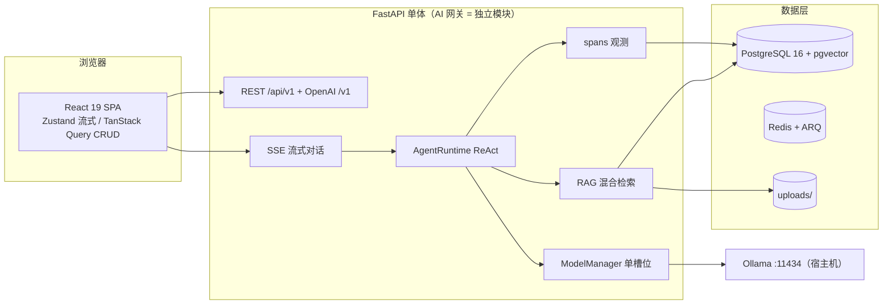

# 多智能体 AI 专家工作台

本地部署的多智能体网站：`/` 技能面板、`@` 接力协作、知识库引用溯源、模型显存调度与可观测性。

## 功能（M1 会话）

- 会话持久化：消息与服务端同步，刷新后完整恢复（含 blocks/思考链）
- 会话侧边栏：搜索分组、置顶、重命名、归档、删除
- 消息操作：停止、重新生成、编辑重发、有用/无用评分
- 标题自动生成：首轮对话后由模型生成会话标题

## 功能（M2 智能体）

- 智能体管理：系统提示词（支持 `{{today}}` 变量）/参数/工具绑定/版本发布与回滚
- 工具调用：内置 `time_now`（当前时间）；`kb_search`（知识库混合检索，见 M3）
- 选择智能体对话：新建会话时选择智能体，按绑定工具自动进入工具循环
- 欢迎语与示例问题：智能体会话展示欢迎语与可点击的示例问题

## 功能（M3 知识库）

- 知识库：上传（pdf/md/txt/docx）/解析/切片/嵌入流水线与文档状态徽章、失败重试
- 混合检索：pgvector 向量检索 + jieba 全文检索（FTS）+ RRF 融合
- 回答引用：引用角标、回答依据与来源抽屉
- 智能体知识库绑定：为智能体绑定知识库并设置 top_k

## 功能（M4 模型调度与协作）

- 模型调度：Ollama 单槽位热切换、显存值守（按需 load/unload）、模型状态接口（GET /api/v1/models/status：当前/已加载/最近切换事件/显存快照与曲线数据，Ollama 不可用时降级回退最近快照）
- `@` 接力协作：消息中 `@` 其他智能体，跨模型串行接力，消息标注智能体归属
- 多模态图片理解：上传图片自动切换到 `qwen2.5vl:7b`，回答结合图片内容（VL 模型按需加载）

## 功能（M5 可观测性）

- 全链路埋点：统一 spans 表覆盖 llm / tool / retrieval / model_switch，trace_id = 助手消息；观测写入批内合并、失败不影响生成
- HTTP 计数：中间件内存按分钟聚合，定时批量落库（不产生每请求写库开销）
- 全局仪表盘（`/admin`）：请求/Token/错误率/p95/模型切换/工具/检索/显存曲线，24h~30d 范围切换
- 会话详情（`/admin/sessions/:id`）：span waterfall + input/output JSON 抽屉 + 工具日志筛选与 CSV 导出
- M4 遗留清偿：模型状态降级（Ollama 不可用回退最近快照）、接力停止语义（排队回合可取消）、会话切换重置 Composer 草稿/提及、孤儿附件 TTL 清理
- 告警（按计划砍除，延后）：`alert_rules` 阈值规则 + ARQ 每分钟评估 + 站内铃铛红点/横幅未实现；数据表已随迁移建好但无对应 API/UI，详见「已知延后项」

## 功能（M6 打磨与发布）

- 思考链：R1 内联 `<think>` 跨 chunk 解析；流式自动展开 +「思考中…」，完成后折叠为「已深度思考 · 用时 x.xs」；全局默认展开开关（侧栏 🧠）
- OpenAI 兼容端点：`POST /v1/chat/completions`（stream/non-stream），`model=agent:{id}`，API Key 管理见 `/keys`（明文仅创建时展示一次）
- Docker 全链路：`docker compose up` 一键起 postgres/redis/backend/worker/frontend（Ollama 仍在宿主机，经 host.docker.internal 接入）
- 前端打磨：rAF 合帧流式渲染 + 高吞吐降级为纯文本 + 错误内联重试；暗色/亮色主题切换；消息列表虚拟滚动（react-virtuoso）
- 演示数据：`python -m scripts.seed_all` 一键灌齐（账号/智能体/知识库/千条会话/旗舰演示会话）

## 一键启动（Docker，推荐）

> 更省事：仓库根目录的 `start.ps1` 已封装完整流程（建 `.env`、前置检查、build/up、等待健康检查、打开浏览器）。
> `.\start.ps1` 走 Docker 全量；`.\start.ps1 -Local` 走本地开发（compose 只起 postgres/redis，前后端跑本机）；`.\start.ps1 -Down` 停止。Windows 也可直接双击 `start.cmd`。

前置：Docker Desktop + 宿主机 Ollama（至少 `ollama pull qwen2.5:7b-instruct-q4_K_M`；接力争演示再拉 `deepseek-r1:latest`，图片演示拉 `qwen2.5vl:7b`，知识库演示拉 `bge-m3`）。

1. 可选：`Copy-Item .env.example .env` 并修改 `PG_PWD` / `JWT_SECRET`（不创建也能跑，默认值仅供本机演示）
2. `docker compose up -d --build`
3. 打开 http://localhost:8890 ，用 `demo / Demo123456` 登录（后端容器启动时自动执行迁移 + `scripts.seed_all`）。端口以 `.env` 的 `FRONTEND_PORT` 为准（本机默认 8890，避开 Windows 保留段；见第 6 条）
4. 排障：`docker compose ps` 看健康状态；`docker compose logs -f backend` 看启动日志；`http://localhost:8900/docs` 看 Swagger（以 `.env` 的 `BACKEND_PORT` 为准）
   - 后端日志统一格式（`时间 级别 logger: 消息`）输出到 stdout：MCP 测试连接/调用、工具执行失败、对话生成异常、未处理异常堆栈都会落在这里；级别用 `LOG_LEVEL` 环境变量调整（默认 INFO）
5. 停止：`docker compose down`（保留数据卷）；`docker compose down -v` 清空数据库与上传文件
6. 端口冲突：前端默认映射 **8090**、后端默认映射 **8000**，两者都可用 `.env` 的 `FRONTEND_PORT` / `BACKEND_PORT` 覆盖。
   - 若打开浏览器看到的是别的程序（例如 Steam 的 `CEF remote debugging` 页面），说明该端口被占用；
   - 若 `docker compose up` 报 `ports are not available ... bind: An attempt was made to access a socket in a way forbidden by its access permissions`，说明端口落在 **Windows 保留段**（Hyper-V/WinNAT）。查一下：`netsh interface ipv4 show excludedportrange protocol=tcp`，然后在 `.env` 里把 `BACKEND_PORT` / `FRONTEND_PORT` 改到保留段之外（例如 8900 / 8890），再 `docker compose up -d`。

架构总览：



## 快速开始（本地开发）

与「一键启动」二选一：本地开发流前端跑 5173、后端跑 `BACKEND_PORT`（默认 8000，可用 `.env` 覆盖；端口落在 Windows 保留段时会被拒绝绑定），只需用 compose 起 postgres 与 redis（不要直接 `docker compose up` 全量起，会占用后端/前端宿主端口）。

1. 安装依赖：Docker Desktop、Ollama（`OLLAMA_MODELS` 指向数据盘）、uv（Python 3.12+）、Node 20+ / pnpm
2. 拉取模型：`ollama pull qwen2.5:7b-instruct-q4_K_M`；M4 演示另需 `ollama pull deepseek-r1:latest` 与 `ollama pull qwen2.5vl:7b`（调度器按需加载，显存不足时自动换出）
3. 起基础设施：`docker compose up -d postgres redis`
4. 起后端：`cd backend && uv sync && uv run alembic upgrade head && uv run python -m scripts.seed && uv run uvicorn app.main:app --reload --port 8000`
5. 起解析 worker（新终端）：`cd backend && uv run arq app.workers.settings.WorkerSettings`（上传文档需要 worker 运行）
6. 起前端：`cd frontend && pnpm i && pnpm dev` → http://localhost:5173（演示账号 demo / Demo123456；登录后左下角「📊 可观测性」进入 `/admin`）

## 外部能力接入

### 联网搜索 MCP（open-websearch）

compose 已内置 `web-search` 服务（open-websearch，端口 3000）：

```powershell
docker compose up -d web-search
```

然后在「🧩 扩展能力 → MCP → 新建 MCP」填：

- 名称：`web-search`
- 连接方式：`http`
- URL：Docker 后端用 `http://web-search:3000/mcp`（容器网络内部端口固定 3000）；本地开发 / 宿主机测试用 `http://localhost:3300/mcp`（宿主端口默认 3300，避开 Windows 保留段）
- 请求头：留空（该服务无需鉴权）

点「测试连接」应列出 `search`、`fetchGithubReadme` 等工具；再到智能体编辑器「扩展能力」里勾选要暴露给模型的 tool（一般只勾 `search`）。

### MinerU 文档解析（替代内置解析，含 OCR）

宿主机独立服务，不装进后端镜像（首次会下载依赖与模型，GB 级）：

```powershell
uv venv D:\mineru\.venv --python 3.12
uv pip install --python D:\mineru\.venv\Scripts\python.exe -U "mineru[all]"
.\scripts\start-mineru.ps1            # 默认 8001 端口
```

在 `.env` 启用（不设则回退内置 pymupdf/docx 解析，无 OCR）：

```
MINERU_API_URL=http://host.docker.internal:8001   # Docker 模式
MINERU_BACKEND=pipeline                           # 纯 CPU；hybrid/vlm 需要 CUDA
# MINERU_API_URL=http://localhost:8001            # 本地开发
```

之后知识库上传 PDF/DOCX（含扫描件）走 MinerU；MinerU 不可用时自动回退内置解析并记 warning 日志。详见 `docs/设计/13-MinerU与联网搜索MCP.md`。

## 演示数据

```powershell
cd backend
uv run python -m scripts.seed_all             # 一键灌齐（等价于以下四条，幂等可重复；Docker 首启也调用它）
uv run python -m scripts.seed                 # 创建 demo / Demo123456
uv run python -m scripts.seed_agents          # 创建 4 个预置智能体（通用助手 / 代码专家 / 时间管家 / 深度思考）
uv run python -m scripts.seed_demo_sessions   # 为 demo 用户创建 1000 个会话与一组演示问答
uv run python -m scripts.seed_kb              # 创建演示知识库「Java 并发笔记」并绑定到「代码专家」（幂等）
```

`seed_demo_sessions` 用于验证侧边栏千级会话下的滚动、搜索与切换性能；`seed_kb` 首次运行会真实解析、切片并用 bge-m3 嵌入演示文档。

「深度思考」预置使用 `deepseek-r1:latest`，便于演示接力玩法：在「代码专家」会话里提问并 `@深度思考`，会话将串行调用两个模型（qwen2.5 → deepseek-r1），消息标注各自智能体，推理模型的回答带思考链；上传图片提问则自动切换到 `qwen2.5vl:7b`。

问完一轮后，聊天页智能体标题栏的「查看调用链」可下钻该条回答的 span waterfall（llm / tool / retrieval / model_switch）与 input/output JSON；左下角「📊 可观测性」进入 `/admin` 查看全局指标（数据来自 spans 与分钟级 HTTP 计数）。

## 30 秒演示（视频/GIF）

前置：按「一键启动（Docker）」起服务并用 `demo / Demo123456` 登录（`scripts.seed_all` 已备好知识库与「旗舰演示」会话）。

| 时间 | 操作 | 看点 |
|---|---|---|
| 0-8s | 「代码专家」提问知识库问题 | 引用角标 + 回答依据（RAG 溯源） |
| 8-16s | 输入 `@` 选「深度思考」发送 | 模型热切换 + 思考链自动展开/折叠（显存调度） |
| 16-24s | 点「查看调用链」 | llm/tool/retrieval/model_switch waterfall + span JSON |
| 24-30s | 打开「📊 可观测性」 | 指标卡片 + 显存曲线（数据面） |

录制与导出：Windows 用 Xbox Game Bar / ScreenToGif 录 30 秒 → 导出 GIF（≤ 8MB，宽 800，15fps：`ffmpeg -i demo.mp4 -vf "fps=15,scale=800:-1" docs/assets/demo.gif`）→ 放置 `docs/assets/demo.gif`。图片占位见 `docs/assets/README.md`。

<!-- 录制完成后取消下一行注释，即得 README 顶部演示图

-->

## 已知延后项（含按计划砍除项，记录备查）

- **告警规则 + 评估任务 + 站内通知（M5 Task 10，按计划有意砍除）**：`alert_rules` / `alert_events` 表已随迁移建好但无 API/UI；阈值规则、ARQ 每分钟评估、仪表盘铃铛红点留待 M6.x 或 Phase 2 复活（非遗漏）。设计 08.5 明确不做的告警 webhook 预留字段、短信/钉钉通知同列于此。
- **后台「模型管理」页（M6 Task 2，按计划有意砍除）**：`POST /api/v1/models/{name}/load|unload` 已随 M6 Task 1 交付（可经 Swagger 或 curl 手动操作），被砍的是仪表盘上的手动 load/unload 管理页（计划标注【可砍】）；显存曲线仍在 `/admin` 只读展示。
- **数据保留清理任务**（spans 90 天 / model_events 30 天 / HTTP 计数 7 天）：设计 02.4 要求，M5 延后至 M6；本期聚焦发布链路未纳入，作为上线后第一批运维项（一个 `retention_service.py` + lifespan 每日循环即可）。
- **`mv_metrics_hourly` 物化视图未启用**：M5 以等价的即时聚合 SQL（`date_trunc('hour')` + `percentile_cont` + `FILTER`，走 `idx_spans_agg`）实现；个人规模（90 天保留）无性能问题，MV + 每分钟 REFRESH 留作规模化优化。
- **历史 spans 的 `user_id` 未回填**：`spans.user_id` 为可空列且无索引（M3 建表），M5 起的埋点才写入归属用户；此前的旧 span 行为 NULL，仪表盘/调用链按当前用户过滤时自然不含这些历史数据。需要时可在保留任务里一并回填或清理。
- **仪表盘打磨（M5 台账遗留）**：空态时四张图整体隐藏（其余图有数也不显示）；智能体活跃排行柱值为 tokens 但排序按 llm_calls；切 24h/7d/30d 无 keepPreviousData 会闪加载态；时间轴为 UTC 字面量（非本地时区）。
- **成本三视角（等效 $ / 显存成本切换 chip）**：依赖设计 02 的 `models` 注册表（`reference_price_in/out`），仍未建表；M6 指标口径维持 Token 量 + GPU 时间。
- **OpenAI 端点 v1 边界**：只接受 `model=agent:{id}`（校验归属，他人智能体 404）；不透传 thinking/tool_call、不执行工具/知识库检索、不持久化会话消息；采样参数使用请求值（未传时端点默认 0.7 / 0.9 / 2048），不读取智能体参数配置；会话映射与 function calling 兼容留待后续按需扩展。
- **`web_search` / `http_request` 工具**：可砍项优先级第 4，保留 `kb_search` + `time_now` 的 function calling 演示能力。
- **多 worker 一致性**：`CANCEL_SESSIONS` / ModelManager / HTTP 内存计数仍按单 worker 假设（与 M4/M5 已知限制一致），容器部署默认单 uvicorn 进程。
- **前端 per-message Zustand slice 的完整形态**：设计 09.2 的「仅该消息组件订阅重渲染」以 TokenBuffer rAF 合帧 + 单活跃流对象近似达成（帧内 ≤60 次提交）；进一步的按消息切片重构收益有限，记录备查。
- **Lighthouse 分数记录**：路线图 M6 的 Lighthouse ≥ 85 为人工验收项，结果记录在 PR/README（不做 CI 门禁）。

## 文档

- 协作约定（含 Obsidian 同步规则）：`AGENTS.md`
- 设计文档：`docs/设计/`（改动后用 `.\scripts\sync-docs.ps1` 同步到 Obsidian）
- 实施计划：`docs/superpowers/plans/`
- 演示素材（GIF 占位与录制说明）：`docs/assets/README.md`
