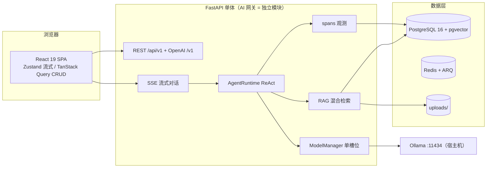

# M6：打磨与发布 实施计划

> **For agentic workers:** REQUIRED SUB-SKILL: Use superpowers:subagent-driven-development (recommended) or superpowers:executing-plans to implement this plan task-by-task. Steps use checkbox (`- [ ]`) syntax for tracking.

**Goal:** 让 Phase 1 达到「可发布、可演示、可被陌生人一键跑起来」的状态：R1 思考链端到端可折叠展示；OpenAI 兼容端点 + API Keys 管理让标准 SDK 可调用智能体；Docker 全链路 + README/GIF/一键启动完成发布叙事；前端补齐降级渲染、暗色主题、错误重试与流式合帧；seed 数据一键齐全并配 30 秒演示脚本；同时清偿 M5 终审遗留（SpanBuffer rollback 加护、附件 GC 单文件容错、模型管理页）。

**Architecture:** 后端新增 `api_keys` 表（设计 02.3 DDL 原样落地）与第二套 Bearer `sk-` 鉴权；`POST /v1/chat/completions`（不在 `/api/v1` 下）走无状态网关：`model=agent:{id}` → 校验归属 → 复用 `ModelManager`/`Provider` 流式生成，不透传 thinking/tool，按 OpenAI chunk 协议输出并写一条 llm span（外部调用同样进仪表盘）。前端以 `uiStore`（zustand，无新依赖）承载主题与思考链默认展开；`TokenBuffer`（rAF 合帧）承接高频 token，单帧超阈值进入纯文本降级；思考块在 streaming 时自动展开、done 后回落折叠。Docker：`backend` 镜像（uv 多阶段）同时跑 API 与 ARQ worker（同一镜像不同 command），`frontend` 镜像 node 构建 + nginx 托管并反代 `/api` 与 `/v1`（`proxy_buffering off` 保 SSE），Ollama 仍跑宿主机经 `host.docker.internal` 接入；后端容器启动即 `alembic upgrade head && python -m scripts.seed_all`，实现 `docker compose up` 后可立即 `demo/Demo123456` 登录。

**Tech Stack:** M0-M5 全部沿用；**本计划不新增任何依赖**（前端 `react-virtuoso`/`echarts`/`zustand` 均已在 `package.json` 且分别出自设计 01.2/09.2、08、09.3；后端无新增；`docker`/`nginx` 为部署工具不入依赖清单）。

**Spec（设计文档）:** `docs/设计/10-部署与简历叙事.md`（Docker/README/GIF/演示脚本主规格）、`09-前端交互设计.md`（思考链折叠/主题/降级渲染）、`06-会话与消息流.md`（thinking 事件与 blocks 约定）、`01-整体架构与技术栈.md`（OpenAI 兼容端点/SSE 协议/架构图）、`11-开发路线图.md`（M6 范围与验收）、`07-模型动态加载与切换.md`（手动 load/unload 与模型管理页）、`02-数据库设计.md`（api_keys DDL）、`03-安全与权限.md`（API Key 规范）。

## Global Constraints

- 沿用 M0-M5 全部工程约束：API 前缀 `/api/v1`（OpenAI 兼容端点按设计固定为 `/v1`，是唯一例外）；Windows + PowerShell；中文 UI；`ensure_ascii=False`；提交前缀 `feat:/fix:/chore:` 且**每任务一次提交**；测试输出 pristine（全绿、无 warning 噪音）。
- **新依赖白名单**：仅设计文档明确指定者。本计划不新增任何依赖（虚拟滚动 `react-virtuoso` 见设计 01.2/09.2，暗色主题用既有 shadcn CSS 变量见设计 09.4，rAF/Zustand 见设计 09.2/09.3 且已在依赖），无需【需裁定】项。
- **分支策略**：`feat/m6-release` 从 `feat/m5-observability` 尖端（`aa83b53`）创建（堆叠；合并顺序 M0→M1→M2→M3→M4→M5→M6）。
- **基线**：后端 134 tests、前端 75 tests 全绿。命令：后端 `uv run pytest -v`、`uv run ruff check .`（目录 `D:\code\webAgent\backend`）；前端 `pnpm run test -- --run`、`pnpm build`（目录 `D:\code\webAgent\frontend`）；git 命令在仓库根 `D:\code\webAgent`。
- **测试计数**：每任务 Step 4 给「基线与预期（≥）」；本计划任务顺序执行、每任务独立提交，前序任务的预期值即后序任务的基线。
- **Docker 验证方式**：Docker 任务无法用单元测试验证 → 以「配置文件静态校验（`docker compose config` + 文件断言测试）+ 控制器 E2E 描述」替代；后端/Frontend 功能任务仍 TDD（先失败测试→实现→全量回归）。
- **鉴权与隔离不得回退**：API Keys 管理接口按 owner 隔离（越权 404）；`/v1/chat/completions` 只能调用 key 归属用户自己的智能体（他人智能体 404，不泄露存在性）；所有既有 API 鉴权行为不变。
- **可砍项**：Task 2（模型管理页）为唯一可砍项，标注见任务内；砍除时仅跳过该任务（Task 1 的手动 load/unload 端点保留，可用 Swagger 操作），最终计数按注记口径验收。
- 所有命令在对应目录执行（后端 `D:\code\webAgent\backend`、前端 `D:\code\webAgent\frontend`、git 与 compose 在仓库根 `D:\code\webAgent`）。

## 执行前准备（控制器/首个执行者，一次性）

```powershell
cd D:\code\webAgent
git checkout feat/m5-observability
git checkout -b feat/m6-release
git log --oneline -1        # 应输出 aa83b53 fix(docs): align readme demo notes with shipped behavior
```

---

### Task 1: M5 遗留后端加固（span flush 护 / 附件 GC 容错）+ 手动模型 load/unload API

**Files:**
- Modify: `backend/app/observability/spans.py`（`SpanBuffer.flush` rollback 加护）
- Modify: `backend/app/services/attachment_service.py`（单文件 unlink 失败 per-file try/except + 日志 + 保留行）
- Modify: `backend/app/ai/model_manager.py`（新增 `unload` 方法）
- Modify: `backend/app/api/v1/model_admin.py`（`POST /models/{name}/load|unload`）
- Test: `backend/tests/test_m6_hardening.py`（4 条，新建）

**Interfaces:**
- Produces: `SpanBuffer.flush(db)`：写入/commit 失败时静默丢弃本批；**rollback 自身失败也不得抛异常**（观测失败不中断流式收尾）。
- Produces: `cleanup_orphan_attachments(...)`：单个文件 `unlink` 抛 `OSError` 时记 `logger.warning("附件清理失败，保留待重试 file=... error=...")`、**保留该 DB 行下轮重试**、继续处理后续文件；返回值只统计成功删除的行数。
- Produces: `ModelManager.unload(model, *, trigger="manual") -> dict`：`_current == model` 时 `provider.unload` + 清槽 + `_log(action="unload")`，返回 `{"unloaded": True}`；否则 `{"unloaded": False, "reason": "not_current"}`（绝不触发未驻留模型的加载）。
- Produces: `POST /api/v1/models/{name}/load` → `{"current": str|None, "switched": bool, "duration_ms": int}`；`POST /api/v1/models/{name}/unload` → `{"unloaded": bool}`；manager 未挂载（`app.state.model_manager` 缺失）返回 503。
- Consumes: 既有 `GET /api/v1/models/status`（含 `degraded`/`vram_history`）。

- [ ] **Step 1: 写失败测试 `backend/tests/test_m6_hardening.py`**

```python
import logging
import uuid
from datetime import UTC, datetime, timedelta

from app.ai.model_manager import ModelManager
from app.main import app
from app.observability.spans import SpanBuffer
from app.services.attachment_service import cleanup_orphan_attachments
from tests.fake_provider import FakeProvider


class FailingDb:
    """commit 与外层 rollback 都失败：观测收尾不得把异常抛回生成链路。"""

    def add_all(self, rows):
        raise RuntimeError("insert failed")

    async def rollback(self):
        raise RuntimeError("rollback failed")


async def test_span_buffer_flush_survives_failed_rollback():
    buffer = SpanBuffer(trace_id=uuid.uuid4())
    buffer.add(type="llm", name="m")
    await buffer.flush(FailingDb())  # 当前实现会因 rollback 抛错
    assert buffer.rows == []  # 观测数据被丢弃，但生成链路不受影响


async def _seed_orphan(session_maker, upload_dir, *, broken: bool):
    from app.models import Attachment, Session, User

    stored = f"{uuid.uuid4()}.png"
    path = upload_dir / stored
    if broken:
        path.mkdir()  # unlink 目录必然失败（Windows: PermissionError；POSIX: IsADirectoryError）
    else:
        path.write_bytes(b"png")
    async with session_maker() as db:
        user = User(
            username=f"u{uuid.uuid4().hex[:8]}",
            email=f"{uuid.uuid4().hex[:8]}@example.com",
            password_hash="x",
        )
        db.add(user)
        await db.flush()
        session = Session(user_id=user.id, title="t")
        db.add(session)
        await db.flush()
        att = Attachment(
            session_id=session.id,
            message_id=None,
            file_path=stored,
            original_name="a.png",
            mime_type="image/png",
            size_bytes=3,
            kind="image",
        )
        db.add(att)
        await db.flush()
        att.created_at = datetime.now(UTC) - timedelta(hours=30)
        await db.commit()
        return att.id, path


async def test_gc_continues_when_single_unlink_fails(session_maker, tmp_path, caplog):
    from app.models import Attachment

    broken_id, broken_path = await _seed_orphan(session_maker, tmp_path, broken=True)
    ok_id, ok_path = await _seed_orphan(session_maker, tmp_path, broken=False)
    with caplog.at_level(logging.WARNING, logger="app.services.attachment_service"):
        removed = await cleanup_orphan_attachments(
            session_factory=session_maker, max_age_hours=24, upload_dir=str(tmp_path)
        )
    assert removed == 1  # 只统计成功删除的行
    assert not ok_path.exists()  # 单文件失败不拖垮整批
    async with session_maker() as db:
        assert await db.get(Attachment, broken_id) is not None  # 保留待下轮重试
        assert await db.get(Attachment, ok_id) is None
    assert any(broken_path.name in record.message for record in caplog.records)


async def test_manual_model_load_and_unload(client, auth_headers, session_maker):
    app.state.model_manager = ModelManager(FakeProvider(), session_factory=session_maker)
    try:
        loaded = await client.post("/api/v1/models/m-manual/load", headers=auth_headers)
        assert loaded.status_code == 200
        body = loaded.json()
        assert body["current"] == "m-manual" and body["switched"] is True

        status = (await client.get("/api/v1/models/status", headers=auth_headers)).json()
        assert status["current"] == "m-manual"

        unloaded = await client.post("/api/v1/models/m-manual/unload", headers=auth_headers)
        assert unloaded.status_code == 200 and unloaded.json()["unloaded"] is True
        assert app.state.model_manager.current is None

        again = await client.post("/api/v1/models/m-manual/unload", headers=auth_headers)
        assert again.status_code == 200 and again.json()["unloaded"] is False
    finally:
        del app.state.model_manager


async def test_manual_model_ops_require_manager(client, auth_headers):
    app.state.model_manager = None  # 显式确保无 manager，避免跨文件串扰
    assert (await client.post("/api/v1/models/m/load", headers=auth_headers)).status_code == 503
    assert (await client.post("/api/v1/models/m/unload", headers=auth_headers)).status_code == 503
```

- [ ] **Step 2: 运行确认失败**

Run: `uv run pytest tests/test_m6_hardening.py -v`
Expected: FAIL（`FailingDb` 触发 rollback 异常；GC 遇目录 unlink 抛错中断且返回 0 行；load/unload 404）

- [ ] **Step 3: 实现**

`spans.py` `flush` 的 except 分支改为：

```python
        except Exception:  # noqa: BLE001 —— 观测写入失败只丢观测
            try:
                await db.rollback()
            except Exception:  # noqa: BLE001, S110 —— rollback 也不可用时不得上抛
                pass
```

`attachment_service.py`：

```python
import logging

logger = logging.getLogger(__name__)

        removed = 0
        for att in rows:
            if "/" not in att.file_path and "\\" not in att.file_path:
                try:
                    (root / att.file_path).unlink(missing_ok=True)
                except OSError as exc:
                    # 单文件失败（如 Windows 文件占用）不拖垮整批；保留行下轮重试
                    logger.warning(
                        "附件清理失败，保留待重试 file=%s error=%s", att.file_path, exc
                    )
                    continue
            await db.delete(att)
            removed += 1
        await db.commit()
        return removed
```

`model_manager.py` 追加（放在 `watch_once` 之前）：

```python
    async def unload(self, model: str, *, trigger: str = "manual") -> dict:
        """手动卸载：只卸载当前驻留槽位，绝不触发未驻留模型的加载。"""
        async with self._lock:
            if self._current != model:
                return {"unloaded": False, "reason": "not_current"}
            vram_before = await self._vram_mb()
            await self.provider.unload(model)
            self._current = None
            await self._log(model, "unload", trigger, vram_before_mb=vram_before)
            return {"unloaded": True}
```

`model_admin.py` 追加（沿用既有 router/auth/db 依赖）：

```python
@router.post("/{name}/load")
async def load_model(
    name: str,
    request: Request,
    user: Annotated[User, Depends(get_current_user)],
):
    manager = getattr(request.app.state, "model_manager", None)
    if manager is None:
        raise HTTPException(status_code=503, detail="模型管理器未就绪")
    try:
        info = await manager.acquire(name, trigger="manual")
    except Exception as exc:  # noqa: BLE001 —— provider 失败转 502，不泄露内部堆栈
        raise HTTPException(status_code=502, detail=f"模型加载失败：{exc}") from exc
    return {"current": manager.current, "switched": info["switched"], "duration_ms": info["duration_ms"]}


@router.post("/{name}/unload")
async def unload_model(
    name: str,
    request: Request,
    user: Annotated[User, Depends(get_current_user)],
):
    manager = getattr(request.app.state, "model_manager", None)
    if manager is None:
        raise HTTPException(status_code=503, detail="模型管理器未就绪")
    return await manager.unload(name)
```

（`model_admin.py` 顶部补 `from fastapi import HTTPException`；`load_model` 的 `user` 参数仅作鉴权依赖，函数体不使用。）

- [ ] **Step 4: 全量测试 + 提交**

Run: `uv run pytest -v`（期望 ≥138 passed：134 + 4）；`uv run ruff check .`

```powershell
git add backend
git commit -m "fix(backend): harden span flush and attachment gc, add manual model ops"
```

---

### Task 2: 前端模型管理页（手动 load/unload + 显存曲线 + 降级提示）【可砍】

> **可砍项**：本任务为设计 07.6 的「后台模型管理页」完整落地，也是路线图 M4 验收项。时间不足时整任务跳过：Task 1 的手动 load/unload 端点保留（Swagger 可用），前端最终计数按「砍除注记」验收；填 Task 4/5/8 的测试计数时按实际基线顺延。执行时仍需按 TDD 全量完成。

**Files:**
- Create: `frontend/src/api/modelsAdmin.ts`
- Create: `frontend/src/components/admin/Chart.tsx`
- Create: `frontend/src/pages/ModelsPage.tsx`
- Modify: `frontend/src/pages/AdminDashboardPage.tsx`（移除页内 Chart，改为复用组件）
- Modify: `frontend/src/App.tsx`（`/admin/models` 路由）
- Modify: `frontend/src/components/sidebar/SessionSidebar.tsx`（「🖥 模型管理」入口）
- Test: `frontend/src/pages/__tests__/ModelsPage.test.tsx`（3 条，新建）

**Interfaces:**
- Produces: `api/modelsAdmin.ts`：`ModelStatus`（`current: string|null`、`loaded: {name,size_vram_mb,expires_at}[]`、`last_snapshot`、`degraded?: boolean`、`vram_history?: {ts,vram_mb}[]`、`recent_events`）、`useModelStatus()`（`queryKey ["model-status"]`，`refetchInterval: 10000`）、`useLoadModel()`/`useUnloadModel()`（成功后 invalidate `["model-status"]`）。
- Produces: `components/admin/Chart.tsx`：`Chart({ label, option, height = 240 })`，`echarts.init` + `setOption(option, true)` + `resize` + `dispose`（与 M5 仪表盘页内实现等价）。
- Produces: `/admin/models` 页面：降级横幅（`degraded` 时显示「Ollama 不可用，正在显示最近快照」+ 快照时间）、当前驻留模型（`data-testid="current-model"`）、已加载表（每行「卸载 <name>」按钮）、可用模型列表（每行「加载 <name>」按钮）、显存曲线（`role="img" aria-label="显存曲线"`）、最近切换事件表。
- Consumes: Task 1 的 `POST /api/v1/models/{name}/load|unload`、既有 `GET /api/v1/models`（`useModels` from `@/api/agents`）。

- [ ] **Step 1: 写失败测试 `frontend/src/pages/__tests__/ModelsPage.test.tsx`**

```tsx
import { render, screen, waitFor } from "@testing-library/react";
import userEvent from "@testing-library/user-event";
import { beforeEach, expect, test, vi } from "vitest";

vi.mock("echarts", () => ({
  init: () => ({ setOption: vi.fn(), resize: vi.fn(), dispose: vi.fn() }),
}));

const mocks = vi.hoisted(() => ({
  status: null as unknown,
  loadArgs: [] as string[],
  unloadArgs: [] as string[],
}));

vi.mock("@/api/modelsAdmin", () => ({
  useModelStatus: () => ({ data: mocks.status, isLoading: false, error: null }),
  useLoadModel: () => ({ mutate: (name: string) => mocks.loadArgs.push(name), isPending: false }),
  useUnloadModel: () => ({
    mutate: (name: string) => mocks.unloadArgs.push(name),
    isPending: false,
  }),
}));

vi.mock("@/api/agents", () => ({
  useModels: () => ({ data: [{ name: "qwen2.5:7b", size_mb: 4700 }] }),
}));

import ModelsPage from "@/pages/ModelsPage";

function status(overrides: Record<string, unknown> = {}) {
  return {
    current: "qwen2.5:7b",
    loaded: [{ name: "qwen2.5:7b", size_vram_mb: 6200, expires_at: null }],
    last_snapshot: { vram_mb: 6200, updated_at: "2026-09-12T10:00:00+00:00" },
    degraded: false,
    vram_history: [{ ts: "2026-09-12T10:00:00+00:00", vram_mb: 6200 }],
    recent_events: [],
    ...overrides,
  };
}

beforeEach(() => {
  mocks.status = status();
  mocks.loadArgs = [];
  mocks.unloadArgs = [];
});

test("展示当前驻留模型与显存曲线", () => {
  render(<ModelsPage />);
  expect(screen.getByTestId("current-model")).toHaveTextContent("qwen2.5:7b");
  expect(screen.getByRole("img", { name: "显存曲线" })).toBeInTheDocument();
});

test("Ollama 降级时展示最近快照提示", () => {
  mocks.status = status({ degraded: true, current: null, loaded: [] });
  render(<ModelsPage />);
  expect(screen.getByText(/显示最近快照/)).toBeInTheDocument();
});

test("手动加载与卸载调用对应操作", async () => {
  mocks.status = status({
    loaded: [
      { name: "qwen2.5:7b", size_vram_mb: 6200, expires_at: null },
      { name: "deepseek-r1:latest", size_vram_mb: 6500, expires_at: null },
    ],
  });
  render(<ModelsPage />);
  await userEvent.click(screen.getByRole("button", { name: "加载 qwen2.5:7b" }));
  await waitFor(() => expect(mocks.loadArgs).toEqual(["qwen2.5:7b"]));
  await userEvent.click(screen.getByRole("button", { name: "卸载 deepseek-r1:latest" }));
  await waitFor(() => expect(mocks.unloadArgs).toEqual(["deepseek-r1:latest"]));
});
```

- [ ] **Step 2: 运行确认失败（模块不存在）**

Run: `pnpm run test -- --run src/pages/__tests__/ModelsPage.test.tsx`
Expected: FAIL（`@/pages/ModelsPage` 不存在）

- [ ] **Step 3: 实现**

`api/modelsAdmin.ts`：

```ts
import { useMutation, useQuery, useQueryClient } from "@tanstack/react-query";
import { apiJson } from "@/lib/api";

export interface LoadedModelInfo {
  name: string;
  size_vram_mb: number;
  expires_at: string | null;
}

export interface ModelEventItem {
  model: string;
  action: string;
  trigger: string | null;
  duration_ms: number | null;
  created_at: string;
}

export interface ModelStatus {
  current: string | null;
  loaded: LoadedModelInfo[];
  last_snapshot: { vram_mb?: number; updated_at?: string | null };
  degraded?: boolean;
  vram_history?: { ts: string; vram_mb: number }[];
  recent_events?: ModelEventItem[];
}

export function useModelStatus() {
  return useQuery({
    queryKey: ["model-status"],
    queryFn: () => apiJson<ModelStatus>("/api/v1/models/status"),
    refetchInterval: 10000,
  });
}

export function useLoadModel() {
  const qc = useQueryClient();
  return useMutation({
    mutationFn: (name: string) =>
      apiJson<{ current: string | null }>(`/api/v1/models/${encodeURIComponent(name)}/load`, {
        method: "POST",
      }),
    onSuccess: () => qc.invalidateQueries({ queryKey: ["model-status"] }),
  });
}

export function useUnloadModel() {
  const qc = useQueryClient();
  return useMutation({
    mutationFn: (name: string) =>
      apiJson<{ unloaded: boolean }>(`/api/v1/models/${encodeURIComponent(name)}/unload`, {
        method: "POST",
      }),
    onSuccess: () => qc.invalidateQueries({ queryKey: ["model-status"] }),
  });
}
```

`components/admin/Chart.tsx`：把 `AdminDashboardPage.tsx` 内的 `Chart` 组件**原样迁移**（含 `useEffect/useRef`、resize 监听与 dispose）；`AdminDashboardPage.tsx` 删除页内定义并改为 `import Chart from "@/components/admin/Chart";`，同步清理不再使用的 `useEffect/useRef` 导入（避免 `tsc` 未使用报错）。

`ModelsPage.tsx` 要点：

```tsx
import * as echarts from "echarts";
import { useMemo } from "react";
import { useModels } from "@/api/agents";
import { useLoadModel, useModelStatus, useUnloadModel } from "@/api/modelsAdmin";
import Chart from "@/components/admin/Chart";
import { Button } from "@/components/ui/button";
import { Card, CardContent } from "@/components/ui/card";

const ACTION_LABEL: Record<string, string> = {
  load: "加载", unload: "卸载", load_failed: "加载失败", evict: "驱逐",
};

export default function ModelsPage() {
  const { data, isLoading, error } = useModelStatus();
  const { data: available = [] } = useModels();
  const load = useLoadModel();
  const unload = useUnloadModel();

  const vramOption = useMemo<echarts.EChartsOption>(() => {
    const rows = data?.vram_history ?? [];
    return {
      tooltip: { trigger: "axis" },
      grid: { left: 64, right: 24, top: 24, bottom: 28 },
      xAxis: { type: "category", boundaryGap: false, data: rows.map((v) => v.ts.slice(11, 16)) },
      yAxis: { type: "value", name: "MB" },
      series: [{ name: "显存", type: "line", smooth: true, data: rows.map((v) => v.vram_mb) }],
    };
  }, [data]);

  return (
    <div className="flex-1 overflow-y-auto">
      <div className="mx-auto max-w-4xl space-y-4 p-6">
        <h1 className="text-xl font-semibold">🖥 模型管理</h1>
        {data?.degraded && (
          <p className="rounded border border-amber-500/50 bg-amber-500/10 px-3 py-2 text-sm">
            Ollama 不可用，正在显示最近快照（{data.last_snapshot?.updated_at ?? "未知时间"}）
          </p>
        )}
        {isLoading && <p className="text-sm text-muted-foreground">加载中…</p>}
        {error && <p className="text-sm text-red-500">{error.message}</p>}
        <Card>
          <CardContent className="pt-4 text-sm">
            当前驻留：
            <span data-testid="current-model" className="ml-1 font-medium">
              {data?.current ?? "无"}
            </span>
          </CardContent>
        </Card>
        <Card>
          <CardContent className="space-y-2 pt-4">
            <p className="text-sm font-medium">已加载模型</p>
            {(data?.loaded ?? []).map((m) => (
              <div key={m.name} className="flex items-center gap-2 text-sm">
                <span className="font-mono">{m.name}</span>
                <span className="text-xs text-muted-foreground">{Math.round(m.size_vram_mb)} MB</span>
                <Button
                  variant="outline" size="sm" className="ml-auto"
                  aria-label={`卸载 ${m.name}`}
                  onClick={() => unload.mutate(m.name)}
                >
                  卸载
                </Button>
              </div>
            ))}
            {(data?.loaded ?? []).length === 0 && (
              <p className="text-sm text-muted-foreground">暂无已加载模型</p>
            )}
          </CardContent>
        </Card>
        <Card>
          <CardContent className="space-y-2 pt-4">
            <p className="text-sm font-medium">可用模型（/api/tags）</p>
            {available.map((m) => (
              <div key={m.name} className="flex items-center gap-2 text-sm">
                <span className="font-mono">{m.name}</span>
                <Button
                  variant="outline" size="sm" className="ml-auto"
                  aria-label={`加载 ${m.name}`}
                  onClick={() => load.mutate(m.name)}
                >
                  加载
                </Button>
              </div>
            ))}
          </CardContent>
        </Card>
        <Card>
          <CardContent className="pt-4">
            <p className="mb-2 text-sm font-medium">显存曲线</p>
            <Chart label="显存曲线" option={vramOption} />
          </CardContent>
        </Card>
        <Card>
          <CardContent className="space-y-1 pt-4 text-sm">
            <p className="font-medium">最近切换事件</p>
            {(data?.recent_events ?? []).map((event) => (
              <p key={`${event.created_at}-${event.model}`} className="text-xs text-muted-foreground">
                {event.created_at.slice(5, 16).replace("T", " ")} · {event.model} ·{" "}
                {ACTION_LABEL[event.action] ?? event.action}
                {event.duration_ms != null ? `（${event.duration_ms}ms）` : ""}
              </p>
            ))}
            {(data?.recent_events ?? []).length === 0 && (
              <p className="text-xs text-muted-foreground">暂无事件</p>
            )}
          </CardContent>
        </Card>
      </div>
    </div>
  );
}
```

`App.tsx` 追加：`<Route path="admin/models" element={<ModelsPage />} />` + 顶部 `import ModelsPage from "@/pages/ModelsPage";`。
`SessionSidebar.tsx` 底部导航「📊 可观测性」之后追加：

```tsx
        <NavLink
          to="/admin/models"
          className={({ isActive }) =>
            `block rounded px-2 py-1.5 text-sm ${isActive ? "bg-accent" : "hover:bg-accent/50"}`
          }
        >
          🖥 模型管理
        </NavLink>
```

- [ ] **Step 4: 全量测试与构建 + 提交**

Run: `pnpm run test -- --run`（期望 ≥78 passed：75 + 3）；`pnpm build`

```powershell
git add frontend
git commit -m "feat(frontend): model management page with manual load and unload"
```

---

### Task 3: R1 thinking 流式解析硬化（旧版内联 `<think>` 跨 chunk / 混排 / 未闭合）

**Files:**
- Modify: `backend/app/ai/providers/ollama.py`（状态化标签解析器替换字符串替换）
- Test: `backend/tests/test_provider_thinking.py`（4 条，新建）

**Interfaces:**
- Consumes: 新版 Ollama `message.thinking` 字段（现状保持：直接产 `thinking` 事件）。
- Produces: `_ThinkTagParser`：跨 chunk 解析 `content` 中内联 `<think>…</think>`；进入/退出思考态的标签可被任意切分；多余 `</think>` 丢弃；无法确定是半个标签的尾部缓存到下一 chunk；流结束时 `flush()` 以当前状态产出剩余内容。对外仍只产 `ChatEvent("thinking"|"token")`，事件顺序为正文流真实顺序。
- 现有 `test_provider_ollama.py` 的 `messages.thinking` 行为不得回退；`test_session_messages.py::test_thinking_block_accumulates`（持久化 thinking block + duration_ms）是端到端护栏。

- [ ] **Step 1: 写失败测试 `backend/tests/test_provider_thinking.py`**

```python
import json

import httpx
import respx

from app.ai.providers.base import ChatRequest
from app.ai.providers.ollama import OllamaProvider

URL = "http://localhost:11434/api/chat"


def _ndjson(*chunks: dict) -> str:
    return "\n".join(json.dumps(chunk) for chunk in chunks)


async def _events(payload: str):
    respx.post(URL).mock(return_value=httpx.Response(200, content=payload.encode("utf-8")))
    provider = OllamaProvider("http://localhost:11434")
    events = [
        event
        async for event in provider.chat_stream(
            ChatRequest(model="m", messages=[{"role": "user", "content": "hi"}])
        )
    ]
    await provider.aclose()
    return events


@respx.mock
async def test_inline_think_tags_split_across_chunks():
    events = await _events(
        _ndjson(
            {"message": {"content": "<thi"}},
            {"message": {"content": "nk>先推理"}},
            {"message": {"content": "</thi"}},
            {"message": {"content": "nk>答案"}},
            {"message": {"content": ""}, "done": True},
        )
    )
    assert [event.type for event in events] == ["thinking", "token", "usage"]
    assert events[0].payload["delta"] == "先推理"
    assert events[1].payload["delta"] == "答案"


@respx.mock
async def test_single_chunk_with_tags_and_stray_close_tag():
    events = await _events(
        _ndjson(
            {"message": {"content": "<think>推理</think>答案</think>继续"}},
            {"message": {"content": ""}, "done": True},
        )
    )
    assert [(e.type, e.payload.get("delta")) for e in events if e.type != "usage"] == [
        ("thinking", "推理"),
        ("token", "答案"),
        ("token", "继续"),
    ]


@respx.mock
async def test_unclosed_thinking_flushed_before_usage():
    events = await _events(
        _ndjson(
            {"message": {"content": "<think>还没想完"}},
            {"message": {"content": ""}, "done": True},
        )
    )
    assert events[0].type == "thinking" and events[0].payload["delta"] == "还没想完"
    assert events[-1].type == "usage"


@respx.mock
async def test_thinking_field_still_wins_over_content():
    events = await _events(
        _ndjson(
            {"message": {"thinking": "字段思考"}},
            {"message": {"content": "正文"}},
            {"message": {"content": ""}, "done": True},
        )
    )
    assert [(e.type, e.payload.get("delta")) for e in events if e.type != "usage"] == [
        ("thinking", "字段思考"),
        ("token", "正文"),
    ]
```

- [ ] **Step 2: 运行确认失败**

Run: `uv run pytest tests/test_provider_thinking.py -v`
Expected: FAIL（跨 chunk 的 `<thi`/`</thi` 被当作正文 token；`</think>` 泄露进正文；部分用例文本与事件不匹配）

- [ ] **Step 3: 实现**

`ollama.py`：删除 `_strip_think_tags`，新增解析器（放在 `OllamaProvider` 之前）：

```python
class _ThinkTagParser:
    """跨 chunk 解析内联 <think>…</think>：旧版 Ollama 把标签混在 content 中。"""

    OPEN = "<think>"
    CLOSE = "</think>"

    def __init__(self) -> None:
        self._buf = ""
        self._in_think = False

    @classmethod
    def _partial_len(cls, text: str) -> int:
        """text 尾部可能是某个标签前缀的最长长度（需缓存到下一 chunk）。"""
        limit = min(len(text), max(len(cls.OPEN), len(cls.CLOSE)) - 1)
        for size in range(limit, 0, -1):
            tail = text[-size:]
            if cls.OPEN.startswith(tail) or cls.CLOSE.startswith(tail):
                return size
        return 0

    def feed(self, content: str) -> list[tuple[str, str]]:
        self._buf += content
        events: list[tuple[str, str]] = []
        while self._buf:
            if self._in_think:
                end = self._buf.find(self.CLOSE)
                if end == -1:
                    keep = self._partial_len(self._buf)
                    head = self._buf[:-keep] if keep else self._buf
                    if head:
                        events.append(("thinking", head))
                    self._buf = self._buf[-keep:] if keep else ""
                    return events
                if end > 0:
                    events.append(("thinking", self._buf[:end]))
                self._buf = self._buf[end + len(self.CLOSE):]
                self._in_think = False
                continue
            start = self._buf.find(self.OPEN)
            close = self._buf.find(self.CLOSE)
            if close != -1 and (start == -1 or close < start):
                if close > 0:  # 多余闭合标签：直接丢弃，不污染正文
                    events.append(("token", self._buf[:close]))
                self._buf = self._buf[close + len(self.CLOSE):]
                continue
            if start == -1:
                keep = self._partial_len(self._buf)
                head = self._buf[:-keep] if keep else self._buf
                if head:
                    events.append(("token", head))
                self._buf = self._buf[-keep:] if keep else ""
                return events
            if start > 0:
                events.append(("token", self._buf[:start]))
            self._buf = self._buf[start + len(self.OPEN):]
            self._in_think = True
        return events

    def flush(self) -> list[tuple[str, str]]:
        if not self._buf:
            return []
        kind = "thinking" if self._in_think else "token"
        delta, self._buf = self._buf, ""
        return [(kind, delta)]
```

`chat_stream` 中：在 `async with ... as resp` 前创建 `parser = _ThinkTagParser()`；内容分支改为：

```python
                content = msg.get("content") or ""
                if content:
                    for kind, delta in parser.feed(content):
                        if delta:
                            yield ChatEvent(kind, {"delta": delta})
```

`done` 分支在产 usage 事件**之前**先冲刷缓冲：

```python
                if chunk.get("done"):
                    for kind, delta in parser.flush():
                        if delta:
                            yield ChatEvent(kind, {"delta": delta})
                    yield ChatEvent("usage", {...})  # 原 usage 载荷不变
```

- [ ] **Step 4: 全量测试 + 提交**

Run: `uv run pytest -v`（期望 ≥142 passed：138 + 4）；`uv run ruff check .`

```powershell
git add backend
git commit -m "fix(backend): parse inline think tags across stream chunks"
```

---

### Task 4: 思考链折叠 UI + 全局默认展开 + 暗色主题

**Files:**
- Create: `frontend/src/stores/ui.ts`
- Modify: `frontend/src/main.tsx`（首屏应用主题）
- Modify: `frontend/src/components/chat/BlockRenderer.tsx`（thinking 分支：streaming 自动展开 + 「思考中…」呼吸动画，done 折叠为「已深度思考 · 用时 x.xs」）
- Modify: `frontend/src/components/chat/MessageItem.tsx`（向 BlockRenderer 传 `streaming={message.status === "streaming"}`）
- Modify: `frontend/src/components/sidebar/SessionSidebar.tsx`（「切换主题」「默认展开思考链」两个开关）
- Test: `frontend/src/stores/__tests__/ui.test.ts`（2 条，新建）
- Test: `frontend/src/components/chat/__tests__/BlockRenderer.test.tsx`（+3）
- Test: `frontend/src/components/sidebar/__tests__/SessionSidebar.test.tsx`（+1）

**Interfaces:**
- Produces: `stores/ui.ts`：`applyTheme(theme)`（`.dark` class 切换 + `localStorage["ui-theme"]`）、`useUiStore`（`theme: "light"|"dark"` 初始值 localStorage → prefers-color-scheme → light；`thinkingDefaultOpen: boolean` 持久化 `localStorage["ui-thinking-open"]`；`toggleTheme()`、`setThinkingDefaultOpen(open)`）。
- Produces: `BlockRenderer` 新 prop `streaming?: boolean`（默认 false）；thinking 块 `<details>` 的 open 状态：`useEffect` 监听 `[streaming, thinkingDefaultOpen]` → `setOpen(streaming || thinkingDefaultOpen)`；streaming 时 summary 为 `<span className="animate-pulse">思考中…</span>`，非 streaming 且有 `duration_ms` 时为 `已深度思考 · 用时 {x.x}s`。
- Consumes: 设计 09.2「thinking block → 灰色斜体折叠面板；streaming 自动展开 + 思考中…；done 后折叠；全局设置『默认展开思考链』」；设计 09.4「深浅色主题（CSS variables + shadcn token）」——`.dark` 变量已在 `index.css` 就位。

- [ ] **Step 1: 写失败测试**

`stores/__tests__/ui.test.ts`：

```ts
import { beforeEach, expect, test } from "vitest";
import { useUiStore } from "@/stores/ui";

beforeEach(() => {
  localStorage.clear();
  document.documentElement.classList.remove("dark");
  useUiStore.setState({ theme: "light", thinkingDefaultOpen: false });
});

test("toggleTheme 切换根节点 class 并持久化", () => {
  useUiStore.getState().toggleTheme();
  expect(useUiStore.getState().theme).toBe("dark");
  expect(document.documentElement.classList.contains("dark")).toBe(true);
  expect(localStorage.getItem("ui-theme")).toBe("dark");
  useUiStore.getState().toggleTheme();
  expect(document.documentElement.classList.contains("dark")).toBe(false);
});

test("setThinkingDefaultOpen 持久化", () => {
  useUiStore.getState().setThinkingDefaultOpen(true);
  expect(useUiStore.getState().thinkingDefaultOpen).toBe(true);
  expect(localStorage.getItem("ui-thinking-open")).toBe("1");
});
```

`BlockRenderer.test.tsx` 追加：

```tsx
import { afterEach } from "vitest";
import { useUiStore } from "@/stores/ui";

afterEach(() => {
  useUiStore.setState({ thinkingDefaultOpen: false });
});

test("流式思考链自动展开并显示思考中", () => {
  render(
    <BlockRenderer block={{ type: "thinking", content: "推理中内容", duration_ms: null }} streaming />,
  );
  const details = screen.getByText("思考中…").closest("details");
  expect(details).toHaveAttribute("open");
  expect(screen.getByText("推理中内容")).toBeInTheDocument();
});

test("完成的思考链默认折叠并显示用时", () => {
  render(<BlockRenderer block={{ type: "thinking", content: "推理完成", duration_ms: 3100 }} />);
  const details = screen.getByText("已深度思考 · 用时 3.1s").closest("details");
  expect(details).not.toHaveAttribute("open");
});

test("默认展开设置对历史消息生效", () => {
  useUiStore.setState({ thinkingDefaultOpen: true });
  render(<BlockRenderer block={{ type: "thinking", content: "历史推理", duration_ms: 1200 }} />);
  expect(screen.getByText("历史推理").closest("details")).toHaveAttribute("open");
});
```

`SessionSidebar.test.tsx` 追加：

```tsx
test("切换主题按钮为根节点添加 dark class", () => {
  useUiStore.setState({ theme: "light" });
  render(
    <MemoryRouter>
      <SessionSidebar />
    </MemoryRouter>,
  );
  fireEvent.click(screen.getByRole("button", { name: "切换主题" }));
  expect(document.documentElement.classList.contains("dark")).toBe(true);
  document.documentElement.classList.remove("dark");
});
```

（该文件需补 `import { useUiStore } from "@/stores/ui";`。）

- [ ] **Step 2: 运行确认失败**

Run: `pnpm run test -- --run src/stores/__tests__/ui.test.ts src/components/chat/__tests__/BlockRenderer.test.tsx src/components/sidebar/__tests__/SessionSidebar.test.tsx`
Expected: FAIL（`@/stores/ui` 模块不存在；thinking 渲染仍是 `思考过程（3s）`；侧栏无「切换主题」按钮）

- [ ] **Step 3: 实现**

`stores/ui.ts`：

```ts
import { create } from "zustand";

export type Theme = "light" | "dark";
const THEME_KEY = "ui-theme";
const THINKING_KEY = "ui-thinking-open";

export function applyTheme(theme: Theme): void {
  document.documentElement.classList.toggle("dark", theme === "dark");
  localStorage.setItem(THEME_KEY, theme);
}

function initialTheme(): Theme {
  const saved = localStorage.getItem(THEME_KEY);
  if (saved === "light" || saved === "dark") return saved;
  return typeof window.matchMedia === "function" &&
    window.matchMedia("(prefers-color-scheme: dark)").matches
    ? "dark"
    : "light";
}

interface UiState {
  theme: Theme;
  thinkingDefaultOpen: boolean;
  toggleTheme: () => void;
  setThinkingDefaultOpen: (open: boolean) => void;
}

export const useUiStore = create<UiState>((set, get) => ({
  theme: initialTheme(),
  thinkingDefaultOpen: localStorage.getItem(THINKING_KEY) === "1",
  toggleTheme: () => {
    const theme: Theme = get().theme === "dark" ? "light" : "dark";
    applyTheme(theme);
    set({ theme });
  },
  setThinkingDefaultOpen: (open) => {
    localStorage.setItem(THINKING_KEY, open ? "1" : "0");
    set({ thinkingDefaultOpen: open });
  },
}));
```

`main.tsx` 在 `createRoot(...).render(...)` 之前加：

```tsx
import { applyTheme, useUiStore } from "@/stores/ui";
...
applyTheme(useUiStore.getState().theme); // 首屏前落 class，避免暗色闪烁
```

`BlockRenderer.tsx`：顶部加 `import { useEffect, useState } from "react";`、`import { useUiStore } from "@/stores/ui";`，props 增加 `streaming?: boolean`（默认 false）；组件体内（任何条件返回之前）：

```tsx
  const thinkingDefaultOpen = useUiStore((s) => s.thinkingDefaultOpen);
  const [thinkingOpen, setThinkingOpen] = useState(thinkingDefaultOpen);

  useEffect(() => {
    setThinkingOpen(streaming || thinkingDefaultOpen);
  }, [streaming, thinkingDefaultOpen]);
```

thinking 分支替换为：

```tsx
  if (block.type === "thinking") {
    return (
      <details
        open={thinkingOpen}
        onToggle={(e) => setThinkingOpen(e.currentTarget.open)}
        className="mb-1 rounded border px-3 py-2 text-sm text-muted-foreground"
      >
        <summary className="cursor-pointer select-none">
          {streaming ? (
            <span className="animate-pulse">思考中…</span>
          ) : block.duration_ms ? (
            `已深度思考 · 用时 ${(block.duration_ms / 1000).toFixed(1)}s`
          ) : (
            "思考过程"
          )}
        </summary>
        <p className="mt-1 whitespace-pre-wrap">{block.content}</p>
      </details>
    );
  }
```

`MessageItem.tsx`：`<BlockRenderer ... streaming={message.status === "streaming"} />`。
`SessionSidebar.tsx`：引入 `useUiStore`，底部「查看归档」之前追加：

```tsx
        <div className="flex gap-1">
          <Button
            variant="ghost"
            size="sm"
            className="flex-1"
            aria-label="切换主题"
            onClick={toggleTheme}
          >
            {theme === "dark" ? "☀️ 亮色" : "🌙 暗色"}
          </Button>
          <Button
            variant="ghost"
            size="sm"
            className="flex-1"
            aria-label="默认展开思考链"
            onClick={() => setThinkingDefaultOpen(!thinkingDefaultOpen)}
          >
            🧠 {thinkingDefaultOpen ? "思考展开" : "思考折叠"}
          </Button>
        </div>
```

（`const { theme, toggleTheme, thinkingDefaultOpen, setThinkingDefaultOpen } = useUiStore();` 可用选择器逐项订阅，风格与现有一致。）

- [ ] **Step 4: 全量测试与构建 + 提交**

Run: `pnpm run test -- --run`（期望 ≥84 passed：78 + 6）；`pnpm build`

```powershell
git add frontend
git commit -m "feat(frontend): collapsible thinking blocks and dark theme"
```

---

### Task 5: 流式 rAF 合帧 + 高吞吐降级渲染 + 错误态重试 + 虚拟滚动回归

**Files:**
- Create: `frontend/src/lib/tokenBuffer.ts`
- Create: `frontend/src/lib/__tests__/tokenBuffer.test.ts`（4 条，新建）
- Modify: `frontend/src/components/chat/ChatView.tsx`（token/thinking 走 TokenBuffer，收尾 flushNow，向子树传 `degraded`/`onRetry`）
- Modify: `frontend/src/components/chat/BlockRenderer.tsx`（`degraded` 时 text 块纯文本渲染）
- Modify: `frontend/src/components/chat/MessageItem.tsx`（`degraded` prop + error 内联「重试」按钮）
- Modify: `frontend/src/components/chat/MessageList.tsx`（透传 `degraded`/`onRetry`）
- Modify: `frontend/src/components/chat/__tests__/ChatView.test.tsx`（mock 支持 `tokens`，+2）
- Modify: `frontend/src/components/chat/__tests__/BlockRenderer.test.tsx`（+1）
- Modify: `frontend/src/components/chat/__tests__/MessageItem.test.tsx`（+1）

**Interfaces:**
- Produces: `lib/tokenBuffer.ts`：`createTokenBuffer(flush, scheduler?)` → `{ push(kind, delta, messageId), flushNow(), cancel(), readonly degraded }`；同一帧内多事件只 flush 一次；换 `messageId` 先 flush 旧批；单帧 `text.length + thinking.length >= DEGRADE_CHARS_PER_FRAME (8000)` 置 `degraded=true`（设计 09.2「>50 token/ms 时降级」的按字符近似，写注释说明）；`scheduler` 默认 `requestAnimationFrame`（不可用时回退 `setTimeout(16)`），可注入便于单测。
- Produces: `ChatView` 用 `useRef` 持有 buffer：`token`/`thinking` 事件只 `push`；`runStream` 开始处 `cancel()` + `setDegraded(false)`，`finally` 先 `flushNow()` 再 `clearActive`；卸载时 `cancel()`。**虚拟滚动已在 M1 落地**（`MessageList` 使用设计 01.2/09.2 指定的 `react-virtuoso`，`followOutput="smooth"`），本任务只做流式追加回归，不改库。
- Produces: `BlockRenderer` 新 prop `degraded?: boolean`：text 块在 `degraded` 时输出 `<p className="whitespace-pre-wrap text-sm">` 纯文本（不解析 markdown），流结束刷新历史消息后自动回退 markdown。
- Produces: `MessageItem` 新 props `degraded?: boolean`、`onRetry?: (id: string) => void`；error 状态提示行内追加「重试」按钮，点击 `onRetry(message.id)`（设计 09.4 错误态）。

- [ ] **Step 1: 写失败测试**

`lib/__tests__/tokenBuffer.test.ts`：

```ts
import { expect, test, vi } from "vitest";
import { createTokenBuffer, type TokenBatch } from "@/lib/tokenBuffer";

function harness() {
  const frames: Array<() => void> = [];
  const schedule = vi.fn((cb: () => void) => {
    frames.push(cb);
    return frames.length;
  });
  const cancel = vi.fn();
  const flushed: TokenBatch[] = [];
  const buffer = createTokenBuffer((batch) => flushed.push(batch), { schedule, cancel });
  return { buffer, flushed, frames, schedule, cancel };
}

test("同一帧内多次 push 只 flush 一次", () => {
  const { buffer, flushed, frames, schedule } = harness();
  buffer.push("text", "你", "m1");
  buffer.push("text", "好", "m1");
  buffer.push("thinking", "想", "m1");
  expect(schedule).toHaveBeenCalledTimes(1);
  expect(flushed).toHaveLength(0); // 未到帧不提交
  frames[0]();
  expect(flushed).toEqual([{ messageId: "m1", text: "你好", thinking: "想" }]);
});

test("切换 messageId 先 flush 旧批", () => {
  const { buffer, flushed } = harness();
  buffer.push("text", "旧", "m1");
  buffer.push("text", "新", "m2");
  expect(flushed.map((batch) => batch.messageId)).toEqual(["m1"]);
  expect(flushed[0].text).toBe("旧");
});

test("flushNow 取消已排帧并立即提交尾部", () => {
  const { buffer, flushed, cancel, frames } = harness();
  buffer.push("text", "尾", "m1");
  buffer.flushNow();
  expect(cancel).toHaveBeenCalledTimes(1);
  expect(flushed).toEqual([{ messageId: "m1", text: "尾", thinking: "" }]);
  expect(frames).toHaveLength(1); // 已排帧被取消、不重复提交
});

test("单帧超过阈值进入降级", () => {
  const { buffer, frames } = harness();
  buffer.push("text", "长".repeat(8000), "m1");
  frames[0]();
  expect(buffer.degraded).toBe(true);
});
```

`ChatView.test.tsx`：mockState 增加 `tokens: string[]`；`vi.mock("@/lib/stream")` 内固定事件之后、`await new Promise(() => {})` 之前加：

```tsx
    for (const delta of mockState.tokens) {
      onEvent({ event: "token", data: { message_id: "m1", delta } });
    }
```

`beforeEach` 增加 `mockState.tokens = [];`。追加两个用例：

```tsx
test("token 经 rAF 合帧后完整渲染", async () => {
  mockState.tokens = ["合", "帧"];
  renderAt("s1");
  await userEvent.type(screen.getByPlaceholderText("输入问题，Enter 发送"), "hi{Enter}");
  expect(await screen.findByText(/合帧/)).toBeInTheDocument();
});

test("单帧超大 token 量降级为纯文本渲染", async () => {
  mockState.tokens = ["**不加粗**" + "长".repeat(9000)];
  renderAt("s1");
  await userEvent.type(screen.getByPlaceholderText("输入问题，Enter 发送"), "hi{Enter}");
  expect(await screen.findByText(/\*\*不加粗\*\*/)).toBeInTheDocument();
  expect(screen.queryByText("不加粗", { selector: "strong" })).not.toBeInTheDocument();
});
```

`BlockRenderer.test.tsx` 追加：

```tsx
test("degraded 时纯文本渲染不解析 markdown", () => {
  render(<BlockRenderer block={{ type: "text", content: "**粗体**" }} degraded />);
  expect(screen.getByText("**粗体**")).toBeInTheDocument();
});
```

`MessageItem.test.tsx` 追加：

```tsx
test("error 状态点击重试回调携带消息 id", async () => {
  const onRetry = vi.fn();
  render(
    <MessageItem message={makeMessage({ status: "error", error: "连接失败" })} onRetry={onRetry} />,
  );
  await userEvent.click(screen.getByRole("button", { name: "重试" }));
  expect(onRetry).toHaveBeenCalledWith("m1");
});
```

（该文件需补 `import userEvent from "@testing-library/user-event";` 与 `vi` 导入。）

- [ ] **Step 2: 运行确认失败**

Run: `pnpm run test -- --run src/lib/__tests__/tokenBuffer.test.ts src/components/chat/__tests__/ChatView.test.tsx src/components/chat/__tests__/BlockRenderer.test.tsx src/components/chat/__tests__/MessageItem.test.tsx`
Expected: FAIL（`@/lib/tokenBuffer` 不存在；大 token 用例仍是 markdown 渲染；无「重试」按钮）

- [ ] **Step 3: 实现**

`lib/tokenBuffer.ts`：

```ts
/** 单帧超过该字符数视为高吞吐（设计 09 的 >50 token/ms 按字符近似），启用纯文本降级 */
export const DEGRADE_CHARS_PER_FRAME = 8000;

export interface TokenBatch {
  messageId: string;
  text: string;
  thinking: string;
}

export interface TokenBufferScheduler {
  schedule: (callback: () => void) => number;
  cancel: (handle: number) => void;
}

const defaultScheduler: TokenBufferScheduler = {
  schedule: (callback) =>
    typeof requestAnimationFrame === "function"
      ? requestAnimationFrame(callback)
      : (setTimeout(callback, 16) as unknown as number),
  cancel: (handle) => {
    if (typeof cancelAnimationFrame === "function") cancelAnimationFrame(handle);
    else clearTimeout(handle);
  },
};

export function createTokenBuffer(
  flush: (batch: TokenBatch) => void,
  scheduler: TokenBufferScheduler = defaultScheduler,
) {
  let batch: TokenBatch = { messageId: "", text: "", thinking: "" };
  let frame: number | null = null;
  let degraded = false;

  function cancelFrame() {
    if (frame !== null) {
      scheduler.cancel(frame);
      frame = null;
    }
  }

  function emitBatch() {
    if (!batch.messageId || (!batch.text && !batch.thinking)) return;
    if (batch.text.length + batch.thinking.length >= DEGRADE_CHARS_PER_FRAME) degraded = true;
    const current = batch;
    batch = { messageId: current.messageId, text: "", thinking: "" };
    flush(current);
  }

  return {
    push(kind: "text" | "thinking", delta: string, messageId: string) {
      if (batch.messageId && batch.messageId !== messageId) {
        cancelFrame(); // 换消息先提交旧批，避免内容串台
        emitBatch();
      }
      batch.messageId = messageId;
      if (kind === "text") batch.text += delta;
      else batch.thinking += delta;
      if (frame === null) frame = scheduler.schedule(() => {
        frame = null;
        emitBatch();
      });
    },
    flushNow() {
      cancelFrame();
      emitBatch();
    },
    cancel() {
      cancelFrame();
      batch = { messageId: "", text: "", thinking: "" };
      degraded = false;
    },
    get degraded() {
      return degraded;
    },
  };
}
```

`ChatView.tsx`：

```tsx
import { createTokenBuffer } from "@/lib/tokenBuffer";
...
  const [degraded, setDegraded] = useState(false);
  const bufferRef = useRef<ReturnType<typeof createTokenBuffer> | null>(null);
  if (bufferRef.current === null) {
    bufferRef.current = createTokenBuffer((batch) => {
      if (batch.text) appendToken(batch.text, batch.messageId);
      if (batch.thinking) appendThinking(batch.thinking, batch.messageId);
      if (bufferRef.current?.degraded) setDegraded(true);
    });
  }
  useEffect(() => () => bufferRef.current?.cancel(), []);
```

`onStreamEvent` 的 token/thinking 分支改为 `bufferRef.current?.push("text"|"thinking", delta, message_id)`；`runStream` 开头 `clear()` 后加 `setDegraded(false); bufferRef.current?.cancel();`，`finally` 第一行 `bufferRef.current?.flushNow();`（先提交最后不足一帧的内容，再 `clearActive`/invalidate）；`<MessageList ... degraded={degraded} onRetry={regenerate} />`。

`BlockRenderer.tsx`：props 增加 `degraded?: boolean`（默认 false）；text 分支：

```tsx
  if (block.type === "text") {
    if (degraded) {
      return <p className="whitespace-pre-wrap text-sm">{block.content ?? ""}</p>;
    }
    return <MarkdownContent content={block.content ?? ""} maxRef={maxRef} onCitation={onCitation} />;
  }
```

`MessageItem.tsx`：props 增加 `degraded?: boolean`、`onRetry?: (id: string) => void`；`<BlockRenderer ... streaming={message.status === "streaming"} degraded={degraded && message.status === "streaming"} />`；error 提示：

```tsx
      {message.status === "error" && (
        <p className="text-sm text-red-500">
          生成失败，可点「重新生成」重试
          {onRetry && (
            <button type="button" className="ml-2 underline" onClick={() => onRetry(message.id)}>
              重试
            </button>
          )}
        </p>
      )}
```

`MessageList.tsx`：props 增加 `degraded?: boolean`、`onRetry?: (id: string) => void`，透传给 `MessageItem`。

- [ ] **Step 4: 全量测试与构建 + 提交**

Run: `pnpm run test -- --run`（期望 ≥92 passed：84 + 8）；`pnpm build`

```powershell
git add frontend
git commit -m "feat(frontend): frame-batched streaming with degraded rendering and retry"
```

---

### Task 6: API Keys 数据模型 + 管理 API + `sk-` 鉴权依赖

**Files:**
- Create: `backend/app/models/api_key.py`
- Modify: `backend/app/models/__init__.py`
- Create: `backend/app/services/api_key_service.py`
- Create: `backend/app/api/v1/keys.py`
- Modify: `backend/app/api/v1/deps.py`（`get_api_key_user`）
- Modify: `backend/app/api/v1/router.py`（挂载 `keys.router`）
- Create: `backend/alembic/versions/<auto>_m6_api_keys.py`（autogenerate）
- Modify: `backend/tests/conftest.py`（TRUNCATE 追加 `api_keys`）
- Test: `backend/tests/test_api_keys.py`（3 条，新建）

**Interfaces:**
- Produces: `ApiKey`（`id/user_id/name/key_prefix(12)/key_hash(255)/last_used_at/revoked/created_at`，user CASCADE FK + index，DDL 对齐设计 02.3）。
- Produces: `api_key_service`：`hash_key(plaintext)`（SHA-256 hex）、`create_key(db,user,name) -> (ApiKey, plaintext)`（`sk-` + `secrets.token_urlsafe(24)` = 35 字符；明文只在创建响应出现一次）、`list_keys(db,user)`（按 created_at 倒序，含已吊销）、`revoke_key(db,user,key_id) -> bool`（置 `revoked=True`；非本人返回 False）、`resolve_key_user(db,plaintext) -> User|None`（查未吊销哈希 + 用户 active，命中即更新 `last_used_at`）。
- Produces: `POST /api/v1/keys`（201，响应含 `key` 明文）→ `{id,name,key_prefix,last_used_at,revoked,created_at,key}`；`GET /api/v1/keys` → `[...]`（无明文）；`DELETE /api/v1/keys/{id}` → 204（越权 404）。
- Produces: `get_api_key_user` FastAPI 依赖：`Authorization: Bearer sk-...` → `User`，无效/吊销/缺头 → 401；供 Task 7 的 `/v1/chat/completions` 使用。

- [ ] **Step 1: 写失败测试 `backend/tests/test_api_keys.py`**

```python
import uuid


async def test_create_list_revoke_key(client, auth_headers):
    created = await client.post("/api/v1/keys", json={"name": "脚本调用"}, headers=auth_headers)
    assert created.status_code == 201
    body = created.json()
    assert body["key"].startswith("sk-") and len(body["key"]) == 35
    assert body["key_prefix"] == body["key"][:12]
    assert body["revoked"] is False

    listed = (await client.get("/api/v1/keys", headers=auth_headers)).json()
    assert [k["id"] for k in listed] == [body["id"]]
    assert "key" not in listed[0]  # 明文只在创建响应出现一次

    deleted = await client.delete(f"/api/v1/keys/{body['id']}", headers=auth_headers)
    assert deleted.status_code == 204
    after = (await client.get("/api/v1/keys", headers=auth_headers)).json()
    assert after[0]["revoked"] is True


async def test_keys_isolated_between_users(client, auth_headers):
    from tests.test_sessions_api import make_user

    created = (await client.post("/api/v1/keys", json={"name": "k"}, headers=auth_headers)).json()
    other = await make_user(client, "bob")
    assert (await client.get("/api/v1/keys", headers=other)).json() == []
    assert (await client.delete(f"/api/v1/keys/{created['id']}", headers=other)).status_code == 404


async def test_resolve_key_user_updates_last_used_and_revoked_fails(client, auth_headers, session_maker):
    from app.models import ApiKey
    from app.services import api_key_service

    created = (await client.post("/api/v1/keys", json={"name": "k"}, headers=auth_headers)).json()
    me = (await client.get("/api/v1/auth/me", headers=auth_headers)).json()
    async with session_maker() as db:
        user = await api_key_service.resolve_key_user(db, created["key"])
        assert user is not None and str(user.id) == me["id"]
        assert await api_key_service.resolve_key_user(db, "sk-不存在的密钥") is None
        assert await api_key_service.resolve_key_user(db, "不是 sk 开头") is None
    async with session_maker() as db:
        row = await db.get(ApiKey, uuid.UUID(created["id"]))
        assert row is not None and row.last_used_at is not None

    await client.delete(f"/api/v1/keys/{created['id']}", headers=auth_headers)
    async with session_maker() as db:
        assert await api_key_service.resolve_key_user(db, created["key"]) is None
```

- [ ] **Step 2: 运行确认失败（404 / ImportError）**

Run: `uv run pytest tests/test_api_keys.py -v`
Expected: FAIL

- [ ] **Step 3: 实现**

`app/models/api_key.py`：

```python
import uuid
from datetime import datetime

from sqlalchemy import DateTime, ForeignKey, String, func
from sqlalchemy.orm import Mapped, mapped_column

from app.models.base import Base


class ApiKey(Base):
    """OpenAI 兼容端点密钥：明文只在创建响应出现一次，库存 SHA-256。"""

    __tablename__ = "api_keys"

    id: Mapped[uuid.UUID] = mapped_column(primary_key=True, default=uuid.uuid4)
    user_id: Mapped[uuid.UUID] = mapped_column(
        ForeignKey("users.id", ondelete="CASCADE"), index=True
    )
    name: Mapped[str] = mapped_column(String(64))
    key_prefix: Mapped[str] = mapped_column(String(12))
    key_hash: Mapped[str] = mapped_column(String(255))
    last_used_at: Mapped[datetime | None] = mapped_column(DateTime(timezone=True), nullable=True)
    revoked: Mapped[bool] = mapped_column(default=False)
    created_at: Mapped[datetime] = mapped_column(DateTime(timezone=True), server_default=func.now())
```

`models/__init__.py`：导入并加入 `__all__`（字典序插入 `ApiKey`）。

`app/services/api_key_service.py`：

```python
import hashlib
import secrets
import uuid
from datetime import UTC, datetime

from sqlalchemy import select
from sqlalchemy.ext.asyncio import AsyncSession

from app.models import ApiKey
from app.models.user import User

KEY_LITERAL_PREFIX = "sk-"
KEY_PREFIX_LEN = 12


def hash_key(plaintext: str) -> str:
    return hashlib.sha256(plaintext.encode("utf-8")).hexdigest()


async def create_key(db: AsyncSession, user: User, name: str) -> tuple[ApiKey, str]:
    plaintext = KEY_LITERAL_PREFIX + secrets.token_urlsafe(24)  # sk- + 32 字符
    key = ApiKey(
        user_id=user.id,
        name=name,
        key_prefix=plaintext[:KEY_PREFIX_LEN],
        key_hash=hash_key(plaintext),
    )
    db.add(key)
    await db.commit()
    await db.refresh(key)
    return key, plaintext


async def list_keys(db: AsyncSession, user: User) -> list[ApiKey]:
    rows = await db.scalars(
        select(ApiKey).where(ApiKey.user_id == user.id).order_by(ApiKey.created_at.desc())
    )
    return list(rows.all())


async def revoke_key(db: AsyncSession, user: User, key_id: uuid.UUID) -> bool:
    key = await db.scalar(select(ApiKey).where(ApiKey.id == key_id, ApiKey.user_id == user.id))
    if key is None:
        return False
    key.revoked = True
    await db.commit()
    return True


async def resolve_key_user(db: AsyncSession, plaintext: str) -> User | None:
    """API Key 鉴权：查哈希 + 更新 last_used_at（best-effort 语义到此为止）。"""
    if not plaintext.startswith(KEY_LITERAL_PREFIX):
        return None
    key = await db.scalar(
        select(ApiKey).where(ApiKey.key_hash == hash_key(plaintext), ApiKey.revoked.is_(False))
    )
    if key is None:
        return None
    user = await db.get(User, key.user_id)
    if user is None or user.status != "active":
        return None
    key.last_used_at = datetime.now(UTC)
    await db.commit()
    return user
```

`app/api/v1/keys.py`：

```python
import uuid
from typing import Annotated

from fastapi import APIRouter, Depends, HTTPException, Response
from pydantic import BaseModel, Field
from sqlalchemy.ext.asyncio import AsyncSession

from app.api.v1.deps import get_current_user
from app.core.db import get_db
from app.models import ApiKey
from app.models.user import User
from app.services import api_key_service

router = APIRouter(prefix="/keys", tags=["keys"])


class KeyCreate(BaseModel):
    name: str = Field(min_length=1, max_length=64)


def _view(key: ApiKey) -> dict:
    return {
        "id": str(key.id),
        "name": key.name,
        "key_prefix": key.key_prefix,
        "last_used_at": key.last_used_at.isoformat() if key.last_used_at else None,
        "revoked": key.revoked,
        "created_at": key.created_at.isoformat() if key.created_at else None,
    }


@router.post("", status_code=201)
async def create_key(
    body: KeyCreate,
    user: Annotated[User, Depends(get_current_user)],
    db: Annotated[AsyncSession, Depends(get_db)],
):
    key, plaintext = await api_key_service.create_key(db, user, body.name)
    return {**_view(key), "key": plaintext}


@router.get("")
async def list_keys(
    user: Annotated[User, Depends(get_current_user)],
    db: Annotated[AsyncSession, Depends(get_db)],
):
    return [_view(key) for key in await api_key_service.list_keys(db, user)]


@router.delete("/{key_id}", status_code=204)
async def delete_key(
    key_id: uuid.UUID,
    user: Annotated[User, Depends(get_current_user)],
    db: Annotated[AsyncSession, Depends(get_db)],
) -> Response:
    if not await api_key_service.revoke_key(db, user, key_id):
        raise HTTPException(status_code=404, detail="密钥不存在")
    return Response(status_code=204)
```

`api/v1/deps.py` 追加：

```python
async def get_api_key_user(
    creds: Annotated[HTTPAuthorizationCredentials | None, Depends(_bearer)],
    db: Annotated[AsyncSession, Depends(get_db)],
) -> User:
    """第二套认证：Authorization: Bearer sk-...（OpenAI 兼容端点用）。"""
    if creds is None:
        raise HTTPException(status_code=401, detail="缺少 API Key")
    from app.services.api_key_service import resolve_key_user

    user = await resolve_key_user(db, creds.credentials)
    if user is None:
        raise HTTPException(status_code=401, detail="无效的 API Key")
    return user
```

`router.py`：`keys` 加入 import 与 `api_router.include_router(keys.router)`。

迁移与测试基建：

```powershell
uv run alembic revision --autogenerate -m "m6 api keys"
uv run alembic upgrade head
uv run alembic check
```

`conftest.py` TRUNCATE 字符串改为：

```
"TRUNCATE chunks, documents, knowledge_bases, agent_kbs, spans, http_stats,"
" alert_events, alert_rules, api_keys, attachments, messages, sessions, refresh_tokens,"
" users, agents, agent_versions, agent_tools, tools, model_events CASCADE"
```

- [ ] **Step 4: 全量测试 + 提交**

Run: `uv run pytest -v`（期望 ≥145 passed：142 + 3）；`uv run ruff check .`；`uv run alembic check` 零漂移

```powershell
git add backend
git commit -m "feat(backend): api keys management and sk bearer auth"
```

---

### Task 7: OpenAI 兼容端点 `POST /v1/chat/completions`

**Files:**
- Create: `backend/app/services/openai_service.py`
- Create: `backend/app/api/v1/openai_compat.py`
- Modify: `backend/app/main.py`（`app.include_router(openai_compat.router)`）
- Test: `backend/tests/test_openai_compat.py`（5 条，新建）

**Interfaces:**
- Produces: `POST /v1/chat/completions`（**不带 `/api/v1` 前缀**，设计 01.5/03.4 固定路径），鉴权 `Authorization: Bearer sk-...`（Task 6 依赖）。
  - 请求：`{model: "agent:{uuid}", messages: [{role: system|user|assistant, content}], stream?: bool=false, temperature?, top_p?, max_tokens?}`。
  - 非流式响应：`{id: "chatcmpl-...", object: "chat.completion", created: <epoch>, model, choices: [{index, message: {role: "assistant", content}, finish_reason: "stop"}], usage: {prompt_tokens, completion_tokens, total_tokens}}`。
  - 流式响应：`text/event-stream`，每行 `data: {"id","object":"chat.completion.chunk","created","model","choices":[{"index":0,"delta":{"content":"..."},"finish_reason":null}]}`，末帧 `delta:{}` + `finish_reason:"stop"`，最后 `data: [DONE]`（JSON 全部 `ensure_ascii=False`，`X-Accel-Buffering: no`）。
  - 错误：model 非 `agent:{uuid}` → 400 `{"error":{"message","type":"invalid_request_error","param":"model","code":null}}`；智能体不存在或不属于 key 用户 → 404 同结构；未认证/吊销 → 401（FastAPI `detail` 结构，SDK 仍按状态码抛 `AuthenticationError`）。
- Produces: `openai_service`：`parse_agent_model(model) -> uuid.UUID`、`prepare(db, user, manager, *, model, messages, temperature, top_p, max_tokens)`（校验归属 → `build_agent_config(db, agent, Session(user_id, title="OpenAI 兼容调用"), user.username)` → `manager.acquire(cfg.model, trigger="api")`（manager 为 None 跳过）→ `ChatRequest`，**不传 tools、不执行检索**）、`complete(...)`、`stream(...)`。
- 设计偏离（记录在案）：v1 网关只透传正文 token（thinking/tool_call 忽略，`content` 不混入思考链）；不持久化会话/消息（外部调用不污染历史）；每请求写一条 `llm` span（`trace_id` 独立 UUID，`user_id`=key 用户）使外部调用可在 `/admin` 仪表盘统计。理由：最小可用面 + 可观测一致性；工具调用/会话映射留待后续按需扩展。
- Consumes: `EffectiveConfig`/`build_agent_config`、`SpanBuffer`、Task 6 的 `get_api_key_user`。

- [ ] **Step 1: 写失败测试 `backend/tests/test_openai_compat.py`**

```python
from sqlalchemy import select

from app.ai.deps import get_provider
from app.main import app
from tests.fake_provider import FakeProvider

AGENT = {
    "name": "API 智能体",
    "system_prompt": "你是 API 助手",
    "model_config": {"model": "m-api"},
    "tags": [],
    "examples": [],
}
MESSAGES = [{"role": "user", "content": "hi"}]


async def _setup(client, auth_headers):
    agent = (await client.post("/api/v1/agents", json=AGENT, headers=auth_headers)).json()
    key = (await client.post("/api/v1/keys", json={"name": "脚本"}, headers=auth_headers)).json()
    return agent["id"], key["key"]


def _auth(key: str) -> dict[str, str]:
    return {"Authorization": f"Bearer {key}"}


async def test_non_stream_completion_and_span(client, auth_headers, session_maker):
    agent_id, key = await _setup(client, auth_headers)
    app.dependency_overrides[get_provider] = lambda: FakeProvider(
        [
            ("token", {"delta": "你"}),
            ("token", {"delta": "好"}),
            ("usage", {"prompt_tokens": 7, "completion_tokens": 3}),
        ]
    )
    r = await client.post(
        "/v1/chat/completions",
        json={"model": f"agent:{agent_id}", "messages": MESSAGES},
        headers=_auth(key),
    )
    assert r.status_code == 200
    data = r.json()
    assert data["object"] == "chat.completion"
    assert data["model"] == f"agent:{agent_id}"
    assert data["choices"][0]["message"] == {"role": "assistant", "content": "你好"}
    assert data["choices"][0]["finish_reason"] == "stop"
    assert data["usage"] == {"prompt_tokens": 7, "completion_tokens": 3, "total_tokens": 10}

    from app.models import Span

    async with session_maker() as db:
        span = (await db.scalars(select(Span).where(Span.type == "llm"))).first()
    assert span is not None and span.model == "m-api" and span.prompt_tokens == 7


async def test_stream_completion_emits_openai_chunks(client, auth_headers):
    agent_id, key = await _setup(client, auth_headers)
    app.dependency_overrides[get_provider] = lambda: FakeProvider(
        [("token", {"delta": "流"}), ("token", {"delta": "式"})]
    )
    r = await client.post(
        "/v1/chat/completions",
        json={"model": f"agent:{agent_id}", "messages": MESSAGES, "stream": True},
        headers=_auth(key),
    )
    assert r.status_code == 200
    assert r.headers["content-type"].startswith("text/event-stream")
    assert '"content": "流"' in r.text
    assert '"content": "式"' in r.text
    assert r.text.rstrip().endswith("data: [DONE]")


async def test_model_format_error(client, auth_headers):
    _agent_id, key = await _setup(client, auth_headers)
    r = await client.post(
        "/v1/chat/completions",
        json={"model": "gpt-4o", "messages": MESSAGES},
        headers=_auth(key),
    )
    assert r.status_code == 400
    assert r.json()["error"]["type"] == "invalid_request_error"


async def test_foreign_agent_hidden_and_auth_required(client, auth_headers):
    from tests.test_sessions_api import make_user

    _agent_id, key = await _setup(client, auth_headers)
    bob = await make_user(client, "bob")
    bob_agent = (await client.post("/api/v1/agents", json=AGENT, headers=bob)).json()
    r = await client.post(
        "/v1/chat/completions",
        json={"model": f"agent:{bob_agent['id']}", "messages": MESSAGES},
        headers=_auth(key),
    )
    assert r.status_code == 404
    assert (
        await client.post(
            "/v1/chat/completions", json={"model": "agent:x", "messages": MESSAGES}
        )
    ).status_code == 401


async def test_revoked_key_rejected(client, auth_headers):
    agent_id, key = await _setup(client, auth_headers)
    keys = (await client.get("/api/v1/keys", headers=auth_headers)).json()
    await client.delete(f"/api/v1/keys/{keys[0]['id']}", headers=auth_headers)
    r = await client.post(
        "/v1/chat/completions",
        json={"model": f"agent:{agent_id}", "messages": MESSAGES},
        headers=_auth(key),
    )
    assert r.status_code == 401
```

- [ ] **Step 2: 运行确认失败（404）**

Run: `uv run pytest tests/test_openai_compat.py -v`
Expected: FAIL

- [ ] **Step 3: 实现**

`app/services/openai_service.py`：

```python
import json
import time
import uuid
from collections.abc import AsyncIterator
from datetime import UTC, datetime

from sqlalchemy.ext.asyncio import AsyncSession

from app.ai.agent_config import EffectiveConfig, build_agent_config
from app.ai.model_manager import ModelManager
from app.ai.providers.base import ChatRequest, ModelProvider
from app.models import Agent, Session
from app.models.user import User
from app.observability.spans import SpanBuffer


class ModelFormatError(ValueError):
    pass


class AgentNotFoundError(LookupError):
    pass


def parse_agent_model(model: str) -> uuid.UUID:
    if not model.startswith("agent:"):
        raise ModelFormatError("model 必须形如 agent:{agent_id}")
    try:
        return uuid.UUID(model[len("agent:"):])
    except ValueError as exc:
        raise ModelFormatError("agent id 不是合法 UUID") from exc


async def prepare(
    db: AsyncSession,
    user: User,
    manager: ModelManager | None,
    *,
    model: str,
    messages: list[dict],
    temperature: float,
    top_p: float,
    max_tokens: int,
) -> tuple[Agent, EffectiveConfig, ChatRequest]:
    agent_id = parse_agent_model(model)
    agent = await db.get(Agent, agent_id)
    if agent is None or agent.owner_id != user.id:
        raise AgentNotFoundError(str(agent_id))
    stub = Session(user_id=user.id, title="OpenAI 兼容调用")
    cfg = await build_agent_config(db, agent, stub, user.username)
    if manager is not None:
        await manager.acquire(cfg.model, trigger="api")
    payload = ([{"role": "system", "content": cfg.system_prompt}] if cfg.system_prompt else []) + messages
    req = ChatRequest(
        model=cfg.model,
        messages=payload,
        temperature=temperature,
        top_p=top_p,
        max_tokens=max_tokens,
        num_ctx=cfg.num_ctx,
    )
    return agent, cfg, req


def _chunk(completion_id: str, created: int, model: str, delta: dict, finish: str | None):
    return {
        "id": completion_id,
        "object": "chat.completion.chunk",
        "created": created,
        "model": model,
        "choices": [{"index": 0, "delta": delta, "finish_reason": finish}],
    }


async def complete(
    db: AsyncSession,
    user: User,
    provider: ModelProvider,
    *,
    agent: Agent,
    req: ChatRequest,
    response_model: str,
) -> dict:
    text: list[str] = []
    usage: dict | None = None
    started_at, started = datetime.now(UTC), time.monotonic()
    buffer = SpanBuffer(trace_id=uuid.uuid4(), user_id=user.id, agent_id=agent.id)
    try:
        async for event in provider.chat_stream(req):
            if event.type == "token":
                text.append(event.payload["delta"])
            elif event.type == "usage":
                usage = event.payload
        prompt = (usage or {}).get("prompt_tokens") or 0
        completion = (usage or {}).get("completion_tokens") or 0
        return {
            "id": f"chatcmpl-{uuid.uuid4().hex[:24]}",
            "object": "chat.completion",
            "created": int(time.time()),
            "model": response_model,
            "choices": [
                {"index": 0, "message": {"role": "assistant", "content": "".join(text)}, "finish_reason": "stop"}
            ],
            "usage": {
                "prompt_tokens": prompt,
                "completion_tokens": completion,
                "total_tokens": prompt + completion,
            },
        }
    finally:
        buffer.add(
            type="llm", name=req.model, model=req.model, status="ok",
            prompt_tokens=(usage or {}).get("prompt_tokens"),
            completion_tokens=(usage or {}).get("completion_tokens"),
            input={"messages": req.messages}, output={"text": "".join(text)},
            started_at=started_at, ended_at=datetime.now(UTC),
            duration_ms=int((time.monotonic() - started) * 1000),
        )
        await buffer.flush(db)


async def stream(
    db: AsyncSession,
    user: User,
    provider: ModelProvider,
    *,
    agent: Agent,
    req: ChatRequest,
    response_model: str,
) -> AsyncIterator[str]:
    completion_id = f"chatcmpl-{uuid.uuid4().hex[:24]}"
    created = int(time.time())
    started_at, started = datetime.now(UTC), time.monotonic()
    buffer = SpanBuffer(trace_id=uuid.uuid4(), user_id=user.id, agent_id=agent.id)
    text: list[str] = []
    usage: dict | None = None
    status, error = "ok", None
    try:
        async for event in provider.chat_stream(req):
            if event.type == "token":
                delta = event.payload["delta"]
                text.append(delta)
                yield f"data: {json.dumps(_chunk(completion_id, created, response_model, {'content': delta}, None), ensure_ascii=False)}\n\n"
            elif event.type == "usage":
                usage = event.payload
            # thinking / tool_call 不透传：v1 网关只输出正文
        yield f"data: {json.dumps(_chunk(completion_id, created, response_model, {}, 'stop'), ensure_ascii=False)}\n\n"
        yield "data: [DONE]\n\n"
    except Exception as exc:  # noqa: BLE001 —— 流中途失败以错误块收尾，不再抛出
        status, error = "error", str(exc)[:300]
        payload = {"error": {"message": "生成失败", "type": "server_error"}}
        yield f"data: {json.dumps(payload, ensure_ascii=False)}\n\n"
        yield "data: [DONE]\n\n"
    finally:
        buffer.add(
            type="llm", name=req.model, model=req.model, status=status, error=error,
            prompt_tokens=(usage or {}).get("prompt_tokens"),
            completion_tokens=(usage or {}).get("completion_tokens"),
            input={"messages": req.messages}, output={"text": "".join(text)},
            started_at=started_at, ended_at=datetime.now(UTC),
            duration_ms=int((time.monotonic() - started) * 1000),
        )
        try:
            await buffer.flush(db)
        except Exception:  # noqa: BLE001 —— 观测失败不影响响应
            pass
```

`app/api/v1/openai_compat.py`：

```python
from typing import Annotated, Literal

from fastapi import APIRouter, Depends
from fastapi.responses import JSONResponse, StreamingResponse
from pydantic import BaseModel, Field
from sqlalchemy.ext.asyncio import AsyncSession

from app.ai.deps import get_model_manager, get_provider
from app.ai.model_manager import ModelManager
from app.ai.providers.base import ModelProvider
from app.api.v1.deps import get_api_key_user
from app.core.db import get_db
from app.models.user import User
from app.services import openai_service

router = APIRouter(tags=["openai-compat"])


class ChatMessage(BaseModel):
    role: Literal["system", "user", "assistant"]
    content: str = ""


class ChatCompletionRequest(BaseModel):
    model: str
    messages: list[ChatMessage] = Field(min_length=1)
    stream: bool = False
    temperature: float = 0.7
    top_p: float = 0.9
    max_tokens: int = 2048


def _error(status: int, message: str, error_type: str = "invalid_request_error") -> JSONResponse:
    return JSONResponse(
        status_code=status,
        content={"error": {"message": message, "type": error_type, "param": "model", "code": None}},
    )


@router.post("/v1/chat/completions")
async def chat_completions(
    body: ChatCompletionRequest,
    user: Annotated[User, Depends(get_api_key_user)],
    db: Annotated[AsyncSession, Depends(get_db)],
    provider: Annotated[ModelProvider, Depends(get_provider)],
    manager: Annotated[ModelManager | None, Depends(get_model_manager)],
):
    try:
        agent, _cfg, req = await openai_service.prepare(
            db,
            user,
            manager,
            model=body.model,
            messages=[message.model_dump() for message in body.messages],
            temperature=body.temperature,
            top_p=body.top_p,
            max_tokens=body.max_tokens,
        )
    except openai_service.ModelFormatError as exc:
        return _error(400, str(exc))
    except openai_service.AgentNotFoundError:
        return _error(404, "智能体不存在")

    if body.stream:
        return StreamingResponse(
            openai_service.stream(
                db, user, provider, agent=agent, req=req, response_model=body.model
            ),
            media_type="text/event-stream",
            headers={"X-Accel-Buffering": "no"},
        )
    return await openai_service.complete(
        db, user, provider, agent=agent, req=req, response_model=body.model
    )
```

`main.py`：`from app.api.v1.openai_compat import router as openai_router`；在 `app.include_router(api_router)` 后追加 `app.include_router(openai_router)`。

- [ ] **Step 4: 全量测试 + 提交**

Run: `uv run pytest -v`（期望 ≥150 passed：145 + 5）；`uv run ruff check .`

```powershell
git add backend
git commit -m "feat(backend): openai compatible chat completions endpoint"
```

---

### Task 8: API Keys 管理 UI（`/keys`）

**Files:**
- Create: `frontend/src/api/keys.ts`
- Create: `frontend/src/pages/KeysPage.tsx`
- Modify: `frontend/src/App.tsx`（`/keys` 路由）
- Modify: `frontend/src/components/sidebar/SessionSidebar.tsx`（「🔑 API 密钥」入口）
- Test: `frontend/src/pages/__tests__/KeysPage.test.tsx`（3 条，新建）

**Interfaces:**
- Produces: `api/keys.ts`：`ApiKeyItem`、`CreatedApiKey`（多 `key` 明文字段）、`useApiKeys()`、`useCreateApiKey()`、`useRevokeApiKey()`（成功 invalidate `["api-keys"]`）。
- Produces: `/keys` 页面：密钥列表（名称/前缀/吊销状态/吊销按钮）、创建表单（`aria-label="密钥名称"`）、创建后明文一次性展示卡（含「复制」按钮）、空态「还没有密钥，先创建一个。」；页面文案指向 `POST /v1/chat/completions` 与 `model=agent:<id>`。

- [ ] **Step 1: 写失败测试 `frontend/src/pages/__tests__/KeysPage.test.tsx`**

```tsx
import { render, screen, waitFor } from "@testing-library/react";
import userEvent from "@testing-library/user-event";
import { beforeEach, expect, test, vi } from "vitest";

const mocks = vi.hoisted(() => ({
  keys: [] as unknown[],
  created: null as unknown,
  createArgs: [] as string[],
  revokeArgs: [] as string[],
}));

vi.mock("@/api/keys", () => ({
  useApiKeys: () => ({ data: mocks.keys, isLoading: false, error: null }),
  useCreateApiKey: () => ({
    mutateAsync: async (name: string) => {
      mocks.createArgs.push(name);
      return mocks.created;
    },
    isPending: false,
  }),
  useRevokeApiKey: () => ({ mutate: (id: string) => mocks.revokeArgs.push(id) }),
}));

import KeysPage from "@/pages/KeysPage";

beforeEach(() => {
  mocks.keys = [];
  mocks.created = null;
  mocks.createArgs = [];
  mocks.revokeArgs = [];
});

test("展示已有密钥的前缀与吊销状态", () => {
  mocks.keys = [
    {
      id: "k1",
      name: "脚本",
      key_prefix: "sk-AbCd1234",
      last_used_at: null,
      revoked: false,
      created_at: null,
    },
  ];
  render(<KeysPage />);
  expect(screen.getByText("脚本")).toBeInTheDocument();
  expect(screen.getByText("sk-AbCd1234…")).toBeInTheDocument();
});

test("创建后明文一次性展示", async () => {
  mocks.created = {
    id: "k2",
    name: "新密钥",
    key_prefix: "sk-New",
    last_used_at: null,
    revoked: false,
    created_at: null,
    key: "sk-plaintext-secret",
  };
  render(<KeysPage />);
  await userEvent.type(screen.getByLabelText("密钥名称"), "新密钥");
  await userEvent.click(screen.getByRole("button", { name: "创建" }));
  expect(await screen.findByText("sk-plaintext-secret")).toBeInTheDocument();
  expect(mocks.createArgs).toEqual(["新密钥"]);
});

test("吊销按钮确认后调用撤销", async () => {
  mocks.keys = [
    {
      id: "k1",
      name: "脚本",
      key_prefix: "sk-AbCd1234",
      last_used_at: null,
      revoked: false,
      created_at: null,
    },
  ];
  vi.spyOn(window, "confirm").mockReturnValue(true);
  render(<KeysPage />);
  await userEvent.click(screen.getByRole("button", { name: "吊销" }));
  await waitFor(() => expect(mocks.revokeArgs).toEqual(["k1"]));
});
```

- [ ] **Step 2: 运行确认失败（模块不存在）**

Run: `pnpm run test -- --run src/pages/__tests__/KeysPage.test.tsx`
Expected: FAIL

- [ ] **Step 3: 实现**

`api/keys.ts`：

```ts
import { useMutation, useQuery, useQueryClient } from "@tanstack/react-query";
import { apiFetch, apiJson } from "@/lib/api";

export interface ApiKeyItem {
  id: string;
  name: string;
  key_prefix: string;
  last_used_at: string | null;
  revoked: boolean;
  created_at: string | null;
}

export interface CreatedApiKey extends ApiKeyItem {
  /** 明文密钥，仅在创建响应出现一次 */
  key: string;
}

export function useApiKeys() {
  return useQuery({
    queryKey: ["api-keys"],
    queryFn: () => apiJson<ApiKeyItem[]>("/api/v1/keys"),
  });
}

export function useCreateApiKey() {
  const qc = useQueryClient();
  return useMutation({
    mutationFn: (name: string) =>
      apiJson<CreatedApiKey>("/api/v1/keys", { method: "POST", body: JSON.stringify({ name }) }),
    onSuccess: () => qc.invalidateQueries({ queryKey: ["api-keys"] }),
  });
}

export function useRevokeApiKey() {
  const qc = useQueryClient();
  return useMutation({
    mutationFn: async (id: string) => {
      const res = await apiFetch(`/api/v1/keys/${id}`, { method: "DELETE" });
      if (!res.ok) throw new Error(`HTTP ${res.status}`);
    },
    onSuccess: () => qc.invalidateQueries({ queryKey: ["api-keys"] }),
  });
}
```

`pages/KeysPage.tsx`：

```tsx
import { useState } from "react";
import { useApiKeys, useCreateApiKey, useRevokeApiKey } from "@/api/keys";
import { Button } from "@/components/ui/button";
import { Card, CardContent } from "@/components/ui/card";
import { Input } from "@/components/ui/input";

export default function KeysPage() {
  const { data: keys = [], isLoading, error } = useApiKeys();
  const createKey = useCreateApiKey();
  const revokeKey = useRevokeApiKey();
  const [name, setName] = useState("");
  const [created, setCreated] = useState<string | null>(null);

  async function onCreate() {
    if (!name.trim()) return;
    const key = await createKey.mutateAsync(name.trim());
    setCreated(key.key);
    setName("");
  }

  return (
    <div className="flex-1 overflow-y-auto">
      <div className="mx-auto max-w-3xl space-y-4 p-6">
        <h1 className="text-xl font-semibold">🔑 API 密钥</h1>
        <p className="text-sm text-muted-foreground">
          OpenAI 兼容端点：<code>POST /v1/chat/completions</code>，model 传{" "}
          <code>agent:&lt;智能体 id&gt;</code>，用 <code>Authorization: Bearer sk-…</code> 调用。
        </p>
        <Card>
          <CardContent className="flex gap-2 pt-4">
            <Input
              aria-label="密钥名称"
              placeholder="密钥名称（如：本地脚本）"
              value={name}
              maxLength={64}
              onChange={(e) => setName(e.target.value)}
            />
            <Button onClick={onCreate} disabled={createKey.isPending}>
              创建
            </Button>
          </CardContent>
        </Card>
        {created && (
          <Card>
            <CardContent className="space-y-2 pt-4">
              <p className="text-sm text-amber-600">明文仅此一次展示，请立即复制保存。</p>
              <code className="block break-all rounded bg-muted p-2 text-xs">{created}</code>
              <Button
                variant="outline"
                size="sm"
                onClick={() => {
                  navigator.clipboard?.writeText(created);
                }}
              >
                复制
              </Button>
            </CardContent>
          </Card>
        )}
        {isLoading && <p className="text-sm text-muted-foreground">加载中…</p>}
        {error && <p className="text-sm text-red-500">{error.message}</p>}
        <div className="space-y-2">
          {keys.map((key) => (
            <div key={key.id} className="flex items-center gap-2 rounded border p-2 text-sm">
              <span className="font-medium">{key.name}</span>
              <code className="text-xs text-muted-foreground">{key.key_prefix}…</code>
              {key.revoked ? (
                <span className="ml-auto text-xs text-muted-foreground">已吊销</span>
              ) : (
                <Button
                  variant="ghost"
                  size="sm"
                  className="ml-auto text-red-500"
                  onClick={() => {
                    if (window.confirm("吊销该密钥？")) revokeKey.mutate(key.id);
                  }}
                >
                  吊销
                </Button>
              )}
            </div>
          ))}
          {!isLoading && keys.length === 0 && (
            <p className="text-sm text-muted-foreground">还没有密钥，先创建一个。</p>
          )}
        </div>
      </div>
    </div>
  );
}
```

`App.tsx` 追加 `<Route path="keys" element={<KeysPage />} />`（`/` 的 children 内）与 import；`SessionSidebar.tsx` 在「📚 知识库」后追加：

```tsx
        <NavLink
          to="/keys"
          className={({ isActive }) =>
            `block rounded px-2 py-1.5 text-sm ${isActive ? "bg-accent" : "hover:bg-accent/50"}`
          }
        >
          🔑 API 密钥
        </NavLink>
```

- [ ] **Step 4: 全量测试与构建 + 提交**

Run: `pnpm run test -- --run`（期望 ≥95 passed：92 + 3）；`pnpm build`

```powershell
git add frontend
git commit -m "feat(frontend): api keys management page"
```

---

### Task 9: 演示数据一键齐全（`seed_all` + 旗舰演示会话）

**Files:**
- Create: `backend/scripts/seed_all.py`
- Modify: `backend/scripts/seed_demo_sessions.py`（新增纯函数 `build_flagship_messages()` + 幂等写入旗舰会话）
- Test: `backend/tests/test_seed_demo.py`（2 条，新建）

**Interfaces:**
- Produces: `scripts/seed_all.py`：顺序执行 `seed → seed_agents → seed_demo_sessions → seed_kb`，每步独立 try/except 并打印失败原因（Ollama/bge-m3 未就绪时仅知识库步骤失败，其余演示数据照常可用）；全部步骤幂等（各脚本自带「已存在跳过」）。
- Produces: `build_flagship_messages() -> list[dict]`：预置一条「全要素」演示会话（思考链 / tool_call+tool_result / citation / 主回答 + 接力回答），消息结构对齐设计 06.2 的 blocks 约定，写入 JSONB 前可直接 `json.dumps(ensure_ascii=False)`。
- Consumes: `seed_demo_sessions.main()` 的 1000 条压力会话逻辑不变；旗舰会话标题固定为 `旗舰演示：Java 并发与 RAG`，已存在则跳过。

- [ ] **Step 1: 写失败测试 `backend/tests/test_seed_demo.py`**

```python
import json


def test_flagship_messages_cover_all_demo_blocks():
    from scripts.seed_demo_sessions import build_flagship_messages

    messages = build_flagship_messages()
    assert messages[0]["role"] == "user"
    assert [m["role"] for m in messages].count("assistant") >= 2  # 主回答 + 接力回答
    types = [block["type"] for message in messages for block in message["blocks"]]
    for expected in ("thinking", "tool_call", "tool_result", "citation", "text"):
        assert expected in types


def test_flagship_thinking_duration_and_json_roundtrip():
    from scripts.seed_demo_sessions import build_flagship_messages

    messages = build_flagship_messages()
    thinking = [
        block for message in messages for block in message["blocks"] if block["type"] == "thinking"
    ]
    assert thinking and all(block["duration_ms"] > 0 for block in thinking)
    dumped = json.dumps(messages, ensure_ascii=False)
    assert "线程池" in dumped  # 直接写入 JSONB：可序列化且中文不转义
```

- [ ] **Step 2: 运行确认失败（ImportError）**

Run: `uv run pytest tests/test_seed_demo.py -v`
Expected: FAIL

- [ ] **Step 3: 实现**

`scripts/seed_demo_sessions.py` 顶部（`TOPICS` 之后）新增：

```python
def build_flagship_messages() -> list[dict]:
    """旗舰演示会话：思考链 / 工具卡片 / 引用 / 接力一屏俱全，开箱即可演示。"""
    return [
        {
            "role": "user",
            "blocks": [{"type": "text", "content": "线程池的核心参数有哪些？@深度思考"}],
        },
        {
            "role": "assistant",
            "status": "done",
            "blocks": [
                {"type": "thinking", "content": "先检索知识库，再组织线程池参数的讲解顺序…", "duration_ms": 2100},
                {
                    "type": "tool_call",
                    "id": "seed-c1",
                    "tool": "kb_search",
                    "args": {"query": "线程池 核心参数"},
                },
                {
                    "type": "tool_result",
                    "id": "seed-c1",
                    "tool": "kb_search",
                    "status": "ok",
                    "elapsed_ms": 120,
                    "preview": "线程池核心参数包括 corePoolSize、maximumPoolSize、workQueue…",
                },
                {
                    "type": "citation",
                    "ref": 1,
                    "chunk_id": "seed-chunk",
                    "source": "java-concurrency.md",
                    "page": None,
                    "score": 0.87,
                    "snippet": "线程池核心参数包括 corePoolSize、maximumPoolSize、workQueue、RejectedExecutionHandler。",
                },
                {
                    "type": "text",
                    "content": "线程池核心参数包括 corePoolSize、maximumPoolSize、workQueue 与拒绝策略 [1]。",
                },
            ],
        },
        {
            "role": "assistant",
            "status": "done",
            "blocks": [
                {"type": "thinking", "content": "补充一个工程取舍：队列类型决定拒绝时机…", "duration_ms": 3200},
                {"type": "text", "content": "补充：使用有界队列 + CallerRunsPolicy 是常见的稳健组合。"},
            ],
        },
    ]
```

`main()` 在批量 1000 条会话提交之后追加旗舰会话（幂等）：

```python
        flagship_title = "旗舰演示：Java 并发与 RAG"
        exists = await db.scalar(
            select(Session).where(Session.user_id == user.id, Session.title == flagship_title)
        )
        if exists is None:
            flagship = Session(user_id=user.id, title=flagship_title, pinned=True, last_message_at=now)
            db.add(flagship)
            await db.flush()
            for item in build_flagship_messages():
                db.add(
                    Message(
                        session_id=flagship.id,
                        role=item["role"],
                        blocks=item["blocks"],
                        status=item.get("status", "done"),
                    )
                )
            await db.commit()
            print(f"已创建旗舰演示会话：{flagship_title}")
```

`scripts/seed_all.py`：

```python
import asyncio


async def main() -> None:
    from scripts import seed, seed_agents, seed_demo_sessions, seed_kb

    steps = (
        ("演示账号", seed),
        ("预置智能体", seed_agents),
        ("演示会话与旗舰演示", seed_demo_sessions),
        ("演示知识库（需要 Ollama + bge-m3）", seed_kb),
    )
    for label, module in steps:
        try:
            await module.main()
        except Exception as exc:  # noqa: BLE001 —— 单步失败不阻塞其余演示数据
            print(f"[seed_all] {label} 步骤失败（可稍后重试）：{exc}")


if __name__ == "__main__":
    asyncio.run(main())
```

- [ ] **Step 4: 全量测试 + 提交**

Run: `uv run pytest -v`（期望 ≥152 passed：150 + 2）；`uv run ruff check .`

（控制器可在本地额外执行一次 `uv run python -m scripts.seed_all` 观察幂等输出；需要开发库与 Ollama，不纳入测试门禁。）

```powershell
git add backend
git commit -m "chore(backend): one-command demo seed data"
```

---

### Task 10: Docker 化全链路（backend/worker/frontend + compose 扩展 + `.env.example`）

> **本任务不做 TDD**：以「配置文件静态校验（Step 1-2）+ 控制器 E2E 描述（Step 3）」验证。Step 1 的 3 条 pytest 为纯文件断言，不依赖 Docker。

**Files:**
- Create: `backend/Dockerfile`、`backend/.dockerignore`
- Create: `frontend/Dockerfile`、`frontend/nginx.conf`、`frontend/.dockerignore`
- Modify: `docker-compose.yml`（在既有 postgres/redis 基础上扩展 backend/worker/frontend）
- Create: `.env.example`（仓库根；compose 变量，默认值保证「不建 .env 也能跑」）
- Test: `backend/tests/test_deploy_config.py`（3 条，新建）

**Interfaces:**
- Produces: `backend` 镜像（`ghcr.io/astral-sh/uv:python3.12-bookworm-slim` 构建阶段 `uv sync --frozen --no-dev` → `python:3.12-slim` 运行阶段拷贝 `/app/.venv` + `alembic/` + `app/` + `scripts/`）；同一镜像两个角色：backend `sh -c "alembic upgrade head && python -m scripts.seed_all && uvicorn app.main:app --host 0.0.0.0 --port 8000"`，worker `arq app.workers.settings.WorkerSettings`；两者共享 `uploads` 卷。
- Produces: `frontend` 镜像（`node:20-alpine` + corepack/pnpm `--frozen-lockfile` 构建 → `nginx:alpine` 托管 `dist`），`nginx.conf` 反代 `/api/` 与 `/v1/` 到 `backend:8000` 且 `proxy_buffering off`（SSE 关键）、`proxy_read_timeout 3600s`，SPA fallback `try_files ... /index.html`。
- Produces: compose 全栈：`postgres`（`${PG_PWD:-webagent}`，healthy）、`redis`（healthy）、`backend`（`extra_hosts: host.docker.internal:host-gateway`，healthcheck 打 `/health`，依赖 postgres/redis healthy）、`worker`（同镜像）、`frontend`（`8080:80`，依赖 backend healthy）；卷 `pgdata` + `uploads`。
- Produces: Ollama 处理=不进容器（设计 10.2 注）：`OLLAMA_BASE_URL` 默认 `http://host.docker.internal:11434`，`extra_hosts` 兼容 Linux。
- 设计偏离（记录在案）：设计 10.2 未给 worker 服务，本计划显式拆出 worker（与 backend 同镜像）以满足文档解析/嵌入 ARQ 任务；backend 端口 8000 对宿主暴露便于 Swagger 与验收，生产可去掉。

- [ ] **Step 1: 写失败测试 `backend/tests/test_deploy_config.py`**

```python
from pathlib import Path

ROOT = Path(__file__).resolve().parents[2]


def test_compose_declares_full_stack():
    text = (ROOT / "docker-compose.yml").read_text(encoding="utf-8")
    for service in ("postgres:", "redis:", "backend:", "worker:", "frontend:"):
        assert f"\n  {service}" in text
    assert "host.docker.internal:host-gateway" in text
    assert "alembic upgrade head" in text and "scripts.seed_all" in text
    assert "8080:80" in text


def test_nginx_proxies_api_and_disables_buffering():
    text = (ROOT / "frontend" / "nginx.conf").read_text(encoding="utf-8")
    assert "proxy_buffering off" in text
    assert "location /api/" in text
    assert "location /v1/" in text
    assert "backend:8000" in text


def test_dockerfiles_use_locked_installs():
    backend = (ROOT / "backend" / "Dockerfile").read_text(encoding="utf-8")
    frontend = (ROOT / "frontend" / "Dockerfile").read_text(encoding="utf-8")
    assert "uv sync --frozen" in backend
    assert "COPY alembic ./alembic" in backend
    assert "pnpm install --frozen-lockfile" in frontend
    assert "nginx" in frontend
```

- [ ] **Step 2: 运行确认失败**

Run: `uv run pytest tests/test_deploy_config.py -v`
Expected: FAIL（Dockerfile/nginx.conf 不存在；compose 无 backend/worker/frontend）
随后每完成一个文件可重跑该文件直至转绿（无需 Docker 守护进程）。

- [ ] **Step 3: 实现**

`docker-compose.yml`（完整替换）：

```yaml
x-backend-env: &backend-env
  DATABASE_URL: postgresql+asyncpg://webagent:${PG_PWD:-webagent}@postgres:5432/webagent
  REDIS_URL: redis://redis:6379/0
  OLLAMA_BASE_URL: ${OLLAMA_BASE_URL:-http://host.docker.internal:11434}
  JWT_SECRET: ${JWT_SECRET:-dev-secret-change-me-0123456789abcdef}
  UPLOAD_DIR: /data/uploads

services:
  postgres:
    image: pgvector/pgvector:pg16
    environment:
      POSTGRES_DB: webagent
      POSTGRES_USER: webagent
      POSTGRES_PASSWORD: ${PG_PWD:-webagent}
    ports:
      - "5432:5432"
    volumes:
      - pgdata:/var/lib/postgresql/data
    healthcheck:
      test: ["CMD-SHELL", "pg_isready -U webagent -d webagent"]
      interval: 5s
      timeout: 5s
      retries: 10

  redis:
    image: redis:7-alpine
    ports:
      - "6379:6379"
    healthcheck:
      test: ["CMD", "redis-cli", "ping"]
      interval: 5s
      timeout: 3s
      retries: 10

  backend:
    build: ./backend
    environment: *backend-env
    volumes:
      - uploads:/data/uploads
    extra_hosts:
      - "host.docker.internal:host-gateway"
    ports:
      - "8000:8000"
    command: ["sh", "-c", "alembic upgrade head && python -m scripts.seed_all && uvicorn app.main:app --host 0.0.0.0 --port 8000"]
    depends_on:
      postgres:
        condition: service_healthy
      redis:
        condition: service_healthy
    healthcheck:
      test: ["CMD", "python", "-c", "import urllib.request; urllib.request.urlopen('http://localhost:8000/health')"]
      interval: 10s
      timeout: 5s
      retries: 12
      start_period: 30s

  worker:
    build: ./backend
    environment: *backend-env
    volumes:
      - uploads:/data/uploads
    extra_hosts:
      - "host.docker.internal:host-gateway"
    command: ["arq", "app.workers.settings.WorkerSettings"]
    depends_on:
      postgres:
        condition: service_healthy
      redis:
        condition: service_healthy

  frontend:
    build: ./frontend
    ports:
      - "8080:80"
    depends_on:
      backend:
        condition: service_healthy

volumes:
  pgdata:
  uploads:
```

`backend/Dockerfile`：

```dockerfile
# 构建阶段：uv 按锁文件安装运行时依赖
FROM ghcr.io/astral-sh/uv:python3.12-bookworm-slim AS builder

ENV UV_COMPILE_BYTECODE=1 \
    UV_LINK_MODE=copy

WORKDIR /app
COPY pyproject.toml uv.lock ./
RUN uv sync --frozen --no-dev

# 运行阶段：仅拷贝虚拟环境与运行所需文件（backend 与 worker 共用本镜像）
FROM python:3.12-slim AS runtime

WORKDIR /app
ENV PATH="/app/.venv/bin:$PATH" \
    PYTHONUNBUFFERED=1 \
    PYTHONDONTWRITEBYTECODE=1

COPY --from=builder /app/.venv /app/.venv
COPY alembic.ini ./
COPY alembic ./alembic
COPY app ./app
COPY scripts ./scripts

EXPOSE 8000
CMD ["uvicorn", "app.main:app", "--host", "0.0.0.0", "--port", "8000"]
```

`backend/.dockerignore`：

```
.venv
__pycache__
*.pyc
.pytest_cache
.ruff_cache
tests
uploads
.env
```

`frontend/Dockerfile`：

```dockerfile
FROM node:20-alpine AS builder
RUN corepack enable
WORKDIR /app
COPY package.json pnpm-lock.yaml ./
RUN pnpm install --frozen-lockfile
COPY . .
RUN pnpm build

FROM nginx:alpine AS runtime
COPY nginx.conf /etc/nginx/conf.d/default.conf
COPY --from=builder /app/dist /usr/share/nginx/html
EXPOSE 80
```

`frontend/nginx.conf`：

```nginx
server {
    listen 80;
    server_name _;

    root /usr/share/nginx/html;
    index index.html;

    # REST API：SSE 必须关闭缓冲，否则流式回答会被整段缓存
    location /api/ {
        proxy_pass http://backend:8000;
        proxy_http_version 1.1;
        proxy_set_header Host $host;
        proxy_set_header X-Real-IP $remote_addr;
        proxy_buffering off;
        proxy_cache off;
        proxy_read_timeout 3600s;
    }

    # OpenAI 兼容端点（外部 SDK 经 8080 调用）
    location /v1/ {
        proxy_pass http://backend:8000;
        proxy_http_version 1.1;
        proxy_set_header Host $host;
        proxy_set_header X-Real-IP $remote_addr;
        proxy_buffering off;
        proxy_read_timeout 3600s;
    }

    location / {
        try_files $uri $uri/ /index.html;
    }
}
```

`frontend/.dockerignore`：

```
node_modules
dist
.vite
```

`.env.example`（仓库根）：

```
# 可选：docker compose 变量。不创建 .env 时使用 compose 内置默认值（仅供本机演示）
PG_PWD=webagent
JWT_SECRET=change-me-to-32-random-chars-0123456789
# OLLAMA_BASE_URL=http://host.docker.internal:11434
```

- [ ] **Step 4: 全量测试 + 提交**

Run: `uv run pytest -v`（期望 ≥155 passed：152 + 3）；`uv run ruff check .`
若本机有 Docker CLI，追加：`docker compose config -q`（零报错）

```powershell
git add backend/Dockerfile backend/.dockerignore frontend/Dockerfile frontend/nginx.conf frontend/.dockerignore docker-compose.yml .env.example backend/tests/test_deploy_config.py
git commit -m "chore: dockerize full stack with one-command startup"
```

---

### Task 11: README 收尾（架构图 / GIF 指引 / 一键启动 / 30 秒演示清单）+ 控制器验收 + 已知延后项

**Files:**
- Modify: `README.md`
- Create: `docs/assets/README.md`（GIF 占位与录制说明）
- （控制器收尾：录制视频/GIF、打标签、推送；实现者不打 tag、不 push）

**Interfaces:**
- Produces: README「架构总览」（mermaid，来自设计 01.1）+「一键启动（Docker）」（`docker compose up -d --build` → http://localhost:8080，demo/Demo123456，容器自动迁移+灌种子）+「30 秒演示（视频/GIF）」（设计 10.6 四步清单 + 录制/GIF 导出指引）+ 日志/排障命令；M5「已知延后项」更新（思考链/OpenAI/Docker 已完成，T10 告警仍砍除）。
- Produces: 30 秒演示脚本（完成定义内，控制器执行）；GIF 由用户录制，放到 `docs/assets/demo.gif` 后按 README 注释替换。

- [ ] **Step 1: README 更新**

1. 在 M5 功能列表后追加：

```markdown
## 功能（M6 打磨与发布）

- 思考链：R1 内联 `<think>` 跨 chunk 解析；流式自动展开 +「思考中…」，完成后折叠为「已深度思考 · 用时 x.xs」；全局默认展开开关（侧栏 🧠）
- OpenAI 兼容端点：`POST /v1/chat/completions`（stream/non-stream），`model=agent:{id}`，API Key 管理见 `/keys`（明文仅创建时展示一次）
- Docker 全链路：`docker compose up` 一键起 postgres/redis/backend/worker/frontend（Ollama 仍在宿主机，经 host.docker.internal 接入）
- 前端打磨：rAF 合帧流式渲染 + 高吞吐降级为纯文本 + 错误内联重试；暗色/亮色主题切换；消息列表虚拟滚动（react-virtuoso）
- 演示数据：`python -m scripts.seed_all` 一键灌齐（账号/智能体/知识库/千条会话/旗舰演示会话）
```

2. 在「快速开始」之前插入：

````markdown
## 一键启动（Docker，推荐）

前置：Docker Desktop + 宿主机 Ollama（至少 `ollama pull qwen2.5:7b-instruct-q4_K_M`；接力争演示再拉 `deepseek-r1:latest`，图片演示拉 `qwen2.5vl:7b`，知识库演示拉 `bge-m3`）。

1. 可选：`Copy-Item .env.example .env` 并修改 `PG_PWD` / `JWT_SECRET`（不创建也能跑，默认值仅供本机演示）
2. `docker compose up -d --build`
3. 打开 http://localhost:8080 ，用 `demo / Demo123456` 登录（后端容器启动时自动执行迁移 + `scripts.seed_all`）
4. 排障：`docker compose ps` 看健康状态；`docker compose logs -f backend` 看启动日志；`http://localhost:8000/docs` 看 Swagger
5. 停止：`docker compose down`（保留数据卷）；`docker compose down -v` 清空数据库与上传文件

架构总览：



````

3. 在 M5「30 秒演示」后追加（或替换为 M6 版本）：

````markdown
## 30 秒演示（视频/GIF）

| 时间 | 操作 | 看点 |
|---|---|---|
| 0-8s | 「代码专家」提问知识库问题 | 引用角标 + 回答依据（RAG 溯源） |
| 8-16s | 输入 `@` 选「深度思考」发送 | 模型热切换 + 思考链自动展开/折叠（显存调度） |
| 16-24s | 点「查看调用链」 | llm/tool/retrieval/model_switch waterfall + span JSON |
| 24-30s | 打开「📊 可观测性」 | 指标卡片 + 显存曲线（数据面） |

录制与导出：Windows 用 Xbox Game Bar / ScreenToGif 录 30 秒 → 导出 GIF（≤ 8MB，宽 800，15fps：`ffmpeg -i demo.mp4 -vf "fps=15,scale=800:-1" docs/assets/demo.gif`）→ 放置 `docs/assets/demo.gif`。图片占位见 `docs/assets/README.md`。

<!-- 录制完成后取消下一行注释，即得 README 顶部演示图

-->
````

4. 更新「已知延后项」：删除「思考链折叠 UI、OpenAI 兼容端点、Docker 化、虚拟滚动打磨：M6」一行；新增/保留以下条目（见文末「已知延后项」）。

`docs/assets/README.md`：

```markdown
# 演示素材

- `demo.gif`：30 秒演示（录制脚本见仓库根 README「30 秒演示」）。录制后放到本目录，并在 README 取消图片行注释。
- 建议规格：宽 800px、15fps、≤ 8MB（GitHub README 加载友好）。
```

- [ ] **Step 2: 全量回归（控制器）**

Run（后端）: `uv run pytest -v`（期望 ≥155）；`uv run ruff check .`；`uv run alembic check` 零漂移
Run（前端）: `pnpm run test -- --run`（期望 ≥95）；`pnpm build`
Run（构建产物性能，可选）: `pnpm preview` + Chrome DevTools Lighthouse（移动端）Performance ≥ 85（路线图 M6 验收项），把分数与截图记入 PR 描述。

- [ ] **Step 3: Docker E2E 验收（控制器执行，陌生机器口径）**

前置：Docker Desktop 运行中；宿主 Ollama 运行且 `ollama list` 至少有 `qwen2.5:7b-instruct-q4_K_M`（接力争另需 `deepseek-r1:latest`，知识库需 `bge-m3`）。

1. `docker compose up -d --build` → `docker compose ps`：postgres/redis/backend 为 `healthy`，worker/frontend 为 `Up`。
2. `docker compose logs backend | Select-String "seed_all|Application startup complete"`：确认迁移 + 种子执行完成；`docker compose logs backend | Select-String "预置智能体"`。
3. 浏览器 http://localhost:8080 → `demo / Demo123456` 登录 → 新建任务选「通用助手」，发送「你好」收到流式回答（SSE 经 nginx 未被缓冲）。
4. 「时间管家」发送「现在几点？」→ 工具卡片 `time_now` 出现且回答完成（function calling 全链路在容器内可用）。
5. 上传一个 md 文件到「Java 并发笔记」→ 文档状态变 `ready`（worker + 宿主 bge-m3 打通）；打开「旗舰演示」会话可见思考链/工具卡片/引用/接力预置内容。
6. 生成一条真实问答后打开「查看调用链」：llm/tool/retrieval span 可见；`/admin` 仪表盘有数据。
7. 外部 SDK 冒烟（可选）：`pip install openai` 后
   `OpenAI(base_url="http://localhost:8080/v1", api_key="sk-...")` → `chat.completions.create(model="agent:<id>", messages=[...])` 返回内容（`sk-` 从 `/keys` 页面创建）。
8. `docker compose down` 后再次 `docker compose up -d`（不重建）→ 登录会话数据仍在（卷持久化）。

- [ ] **Step 4: 提交**

```powershell
git add README.md docs/assets
git commit -m "chore: m6 readme, demo script and release polish"
```

> 完成后由控制器录制 30 秒视频并导出 `docs/assets/demo.gif`（放好后可再补一次 `chore: add demo gif` 提交），打标签 `m6-release` 并按既有流程推送/PR。

---

## 完成定义（M6 Done）

- [ ] 后端 `uv run pytest -v` ≥ 155 passed（Task 2 为前端任务，砍除不影响后端计数；Task 1 的模型端点保留）；`uv run ruff check .` 干净；`uv run alembic check` 零漂移
- [ ] 前端 `pnpm run test -- --run` ≥ 95 passed（Task 2 砍除时 ≥ 92）；`pnpm build` 通过
- [ ] R1 思考链：真实 `deepseek-r1:latest` 会话中，流式自动展开「思考中…」，完成后折叠显示用时；侧栏「默认展开思考链」开关对历史消息生效
- [ ] OpenAI 兼容：`/keys` 创建 key → 标准 SDK 以 `agent:{id}` 调通（stream 与非 stream 各一次）；吊销后 401；他人智能体 404；调用出现在 `/admin` 指标
- [ ] 暗色主题切换即时生效且刷新后保持；高吞吐流式场景渲染为纯文本、结束后恢复 markdown；错误消息可点「重试」
- [ ] Task 10 Step 3 的 8 项 Docker E2E 全过（真实 Ollama + 真实请求）；`docker compose config -q` 零报错
- [ ] `uv run python -m scripts.seed_all` 幂等可重复执行；旗舰演示会话含 thinking/tool/citation/接力
- [ ] README 更新完成：架构图、一键启动、30 秒演示清单；GIF 录制指引就位（GIF 本体由用户录制后补交）
- [ ] 分支 `feat/m6-release` 每任务一次提交；标签 `m6-release` 已打（控制器）
- [ ] 多用户隔离抽查：用户 B 的 `/v1/chat/completions` 调用户 A 的智能体 → 404；B 看不到 A 的 key（列表为空、删除 404）

## 已知延后项（不在 M6 范围，记录备查）

- **告警规则 + 评估任务 + 站内通知（M5 Task 10，按计划有意砍除）**：`alert_rules`/`alert_events` 表已建好但无 API/UI；阈值规则、ARQ 每分钟评估、仪表盘铃铛红点留待 M6.x 或 Phase 2 复活。设计 08.5 明确不做的 webhook/短信/钉钉同列于此。
- **数据保留清理任务**（spans 90 天 / model_events 30 天 / HTTP 计数 7 天）：设计 02.4 要求，M5 延后至 M6；本期聚焦发布链路未纳入，作为上线后第一批运维项（一个 `retention_service.py` + lifespan 每日循环即可）。
- **`mv_metrics_hourly` 物化视图**：M5 已注明以即时聚合 SQL 等价实现；个人规模无性能问题，MV 留作规模化优化。
- **成本三视角（等效 $）**：依赖设计 02 的 `models` 注册表（`reference_price_in/out`），仍未建表；M6 指标口径维持 Token 量 + GPU 时间。
- **OpenAI 端点 v1 边界**：不透传 thinking/tool_call、不执行工具/知识库检索、不持久化会话消息；会话映射与 function calling 兼容留待后续按需扩展。
- **`web_search` / `http_request` 工具**：可砍项优先级第 4，保留 `kb_search` + `time_now` 的 function calling 演示能力。
- **多 worker 一致性**：`CANCEL_SESSIONS` / ModelManager / HTTP 内存计数仍按单 worker 假设（与 M4/M5 已知限制一致），容器部署默认单 uvicorn 进程。
- **前端 per-message Zustand slice 的完整形态**：设计 09.2 的「仅该消息组件订阅重渲染」以 TokenBuffer rAF 合帧 + 单活跃流对象近似达成（帧内 ≤60 次提交）；进一步的按消息切片重构收益有限，记录备查。
- **Lighthouse 分数记录**：路线图 M6 的 Lighthouse ≥ 85 为人工验收项，结果记录在 PR/README（不做 CI 门禁）。
