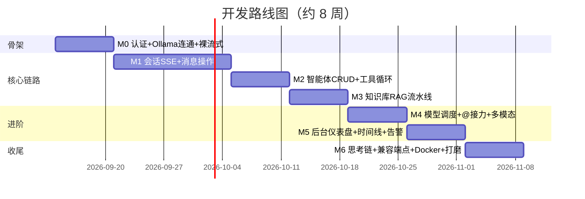

# 多智能体 AI 专家工作台 — 设计总览

> **一句话定位**：本地部署的多智能体网站。用户在一个类 ChatGPT 的会话界面中与多个不同专长的智能体交互（`/` 技能面板、`@` 接力协作、知识库引用溯源），后台提供智能体管理、知识库管理、模型显存调度与完整可观测性。**个人求职展示项目，目标岗位：AI 应用工程师。**

## 核心约束

| 项 | 值 |
|---|---|
| 硬件 | Ryzen 9 9955HX / 32GB DDR5 / **RTX 5070 Ti Laptop 12GB 显存** |
| 推理 | Ollama 本地部署（GGUF 量化），不依赖云端 API |
| 显存硬约束 | **同时只能驻留一个 LLM**，需动态加载/卸载与显存监控 |
| 部署 | docker-compose 一键起（Ollama 除外，跑在宿主机） |

## 关键决策记录（ADR）

| #   | 决策                                              | 备选与理由                                                                | 详见               |
| --- | ----------------------------------------------- | -------------------------------------------------------------------- | ---------------- |
| D1  | 后端 **FastAPI 单体**（AI 网关为独立模块）                   | 备选：Spring Boot + FastAPI 双后端（+40% 工作量）；架构上预留拆分，未来可用 Spring Boot 包平台层 | [[01-整体架构与技术栈]]  |
| D2  | 前端 **React 19 + Vite**，流式用 **SSE** 而非 WebSocket | 聊天是单向下行流；SSE 代理友好、自动重连、类型化事件协议                                       | [[01-整体架构与技术栈]]  |
| D3  | 向量检索用 **pgvector**（PG 单库）                       | 备选 Qdrant/Milvus：个人规模（万级 chunk）远未触顶，单库事务与 JOIN 更优雅                   | [[05-知识库RAG]]    |
| D4  | **多用户 + 数据隔离**（JWT，user/admin 两级角色）             | 不做工作区/团队层（SaaS 化过度设计）                                                | [[03-安全与权限]]     |
| D5  | `@` 协作采用**接力式**（串行换模型）                          | 单显存约束下，编排式并行本质不可行                                                    | [[06-会话与消息流]]    |
| D6  | 可观测性**自研统一 spans 表**（Langfuse 式）                | 备选 Langfuse/Phoenix：黑盒集成，求职项目"讲得清"更值钱                                | [[08-监控与可观测性]]   |
| D7  | 模型调度采用**单活跃槽位 + 接力切换**状态机                       | 12GB 显存无法双模型同驻                                                       | [[07-模型动态加载与切换]] |
| D8  | **双项目组合：自建先行（M0~M6），Open WebUI fork 二开列为第二期**；Phase 1 期间 Open WebUI 仅作参照/日常工具/面试选型素材 | 备选：并行双线（一人精力不足，两头烂尾风险）/ 直接 fork（叙事弱、License 强制保留品牌、改造省时有限）。二开价值 = 证明大型代码库协作与最小侵入集成能力，与自建互补 | [[10-部署与简历叙事]] |

## 文档索引

| 文件 | 内容 | 对应脑暴方向 |
|---|---|---|
| [[01-整体架构与技术栈]] | 技术栈、SSE 事件协议、目录结构、API 总览、ModelProvider 抽象 | 方向 1 |
| [[02-数据库设计]] | ER 图、全量 DDL、设计决策 | 方向 2 |
| [[03-安全与权限]] | JWT 认证、数据隔离、API 密钥、上传与工具安全 | 方向 9 |
| [[04-智能体管理模块]] | 配置 Schema、工具注册表、版本控制、变量插值 | 方向 3 |
| [[05-知识库RAG]] | 上传/切片/向量化流水线、混合检索 + RRF、引用溯源 | 方向 4 |
| [[06-会话与消息流]] | AgentRuntime 执行循环、流式细节、@接力协议、blocks 结构 | 方向 5 |
| [[07-模型动态加载与切换]] | 显存预算、状态机、ModelManager、模型选型 | 方向 6 |
| [[08-监控与可观测性]] | spans 埋点、成本口径、聚合视图、告警、可视化 | 方向 7 |
| [[09-前端交互设计]] | 页面结构、/ 面板、@ 提及、引用卡片、思考链折叠、性能 | 方向 8 |
| [[10-部署与简历叙事]] | 环境搭建、docker-compose、面试 Q&A、简历 bullet、演示脚本 | 方向 10 |
| [[11-开发路线图]] | M0~M6 里程碑、验收标准、可砍项、风险清单 | 路线图 |

## 里程碑概览

## 当前状态

- [x] 需求脑暴完成（对话中逐节评审通过）
- [x] 设计文档撰写（本目录）
- [ ] 实施计划（writing-plans）
- [ ] 编码实现
