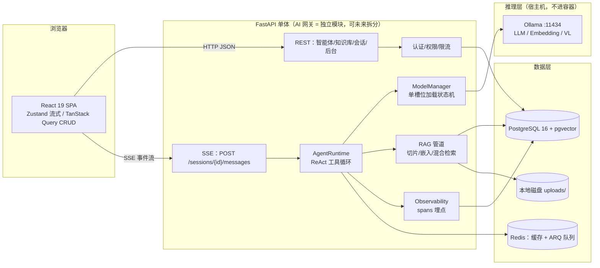

# 01 整体架构与技术栈

## 1.1 架构总图



## 1.2 技术栈总表

| 层 | 选型 | 理由 |
|---|---|---|
| 前端框架 | React 19 + Vite + TypeScript | 求职市场主流 |
| UI | TailwindCSS + shadcn/ui | 质感好、可深度定制 |
| 状态/数据 | Zustand（会话流）+ TanStack Query（CRUD） | 流式 token 高频更新不重渲染全树 |
| 流式渲染 | react-markdown + remark-gfm + shiki + react-virtuoso | 长会话虚拟滚动 |
| 后端 | Python 3.12 + FastAPI + SQLAlchemy 2.0(async) + Pydantic v2 + Alembic | 方案 A（见 [[00-项目总览]] D1） |
| 数据库 | PostgreSQL 16 + pgvector；Redis（缓存 + ARQ） | [[02-数据库设计]] / [[05-知识库RAG]] |
| 后台任务 | ARQ（Redis 轻量异步队列） | 文件解析/切片/嵌入异步化 |
| 推理 | Ollama（本地，原生 function calling） | 硬约束 |
| 可视化 | ECharts（仪表盘 + 调用链 waterfall） | [[08-监控与可观测性]] |
| 部署 | docker-compose（frontend/backend/postgres/redis） | [[10-部署与简历叙事]] |

## 1.3 通信方式：SSE 事件协议

**决策：SSE 而非 WebSocket**。聊天是单向下行流，控制面（停止、切换模型）用普通 POST。ChatGPT 生产环境同为 SSE。优点：代理友好、自动重连、文本协议好调试。

FastAPI 实现：`StreamingResponse(media_type="text/event-stream")`。**事件类型化**是整个设计的枢纽——思考链可视化、引用展示、模型切换提示全部依赖事件类型分发：

| event | data 载荷 | 用途 |
|---|---|---|
| `message_start` | `{msg_id, agent_id, model}` | 开始生成一条助手消息 |
| `token` | `{msg_id, delta}` | 正文增量 |
| `thinking` | `{msg_id, delta}` | 思考链增量（R1 系） |
| `tool_call` | `{msg_id, tool, args, call_id}` | 模型发起工具调用 |
| `tool_result` | `{msg_id, tool, status, elapsed_ms}` | 工具执行完成 |
| `citation` | `{msg_id, doc, chunk_id, source, page, score}` | 知识库引用 |
| `model_switching` | `{from, to, stage}` | 正在卸载/加载模型 |
| `error` | `{msg_id, code, message}` | 出错 |
| `done` | `{msg_id, usage, latency}` | 结束（含 Token/耗时） |

```json
event: token
data: {"delta": "根据检索结果", "msg_id": "m_01J9..."}

event: citation
data: {"doc_id": "d_3", "chunk_id": "c_42", "source": "Java并发编程.pdf", "page": 12, "score": 0.87}

event: done
data: {"usage": {"prompt_tokens": 1520, "completion_tokens": 380}, "latency_ms": {"first_token": 412, "total": 8300}}
```

## 1.4 仓库结构

```
webAgent/
├─ frontend/                  # React SPA（pnpm）
│  └─ src/{pages,components,stores,hooks,lib}
├─ backend/
│  ├─ app/
│  │  ├─ api/v1/              # 路由：auth/agents/tools/kbs/sessions/models/admin
│  │  ├─ core/                # 配置(pydantic-settings)、安全、依赖注入
│  │  ├─ models/              # SQLAlchemy ORM
│  │  ├─ schemas/             # Pydantic DTO
│  │  ├─ services/            # 业务 CRUD
│  │  ├─ ai/                  # ★ AI 网关模块（未来可拆独立服务）
│  │  │  ├─ providers/        #   base.py + ollama.py + openai_compat.py
│  │  │  ├─ runtime.py        #   AgentRuntime 执行循环
│  │  │  ├─ model_manager.py  #   ★ 加载状态机
│  │  │  ├─ tools/            #   工具注册表 + 内置工具
│  │  │  └─ rag/              #   切片/嵌入/检索
│  │  ├─ observability/       #   spans 记录器、指标
│  │  └─ workers/             #   ARQ 任务（解析/嵌入/标题/告警评估）
│  └─ alembic/                # 迁移
├─ docker-compose.yml
└─ docs/                      # 设计文档同步副本
```

## 1.5 核心 API 总览

| 组 | 方法与路径 | 说明 |
|---|---|---|
| 认证 | `POST /api/v1/auth/register` `login` `refresh` `logout`；`GET /auth/me` | JWT，见 [[03-安全与权限]] |
| 智能体 | `GET/POST /agents`；`GET/PATCH/DELETE /agents/{id}` | CRUD，含 model_config 校验 |
| | `POST /agents/{id}/publish`；`GET /agents/{id}/versions`；`POST /agents/{id}/rollback` | 版本控制，见 [[04-智能体管理模块]] |
| 工具 | `GET /tools` | 注册表列表（供勾选矩阵渲染） |
| 知识库 | `GET/POST/PATCH/DELETE /kbs`；`POST /kbs/{id}/documents`(multipart)；`GET /kbs/{id}/documents/{doc_id}`(状态轮询)；`DELETE ...` | 见 [[05-知识库RAG]] |
| 会话 | `POST /sessions`；`GET /sessions?query=&archived=`；`PATCH /sessions/{id}`(置顶/重命名/归档)；`DELETE` | 历史搜索/分组/删除 |
| 消息 | `GET /sessions/{id}/messages`；**`POST /sessions/{id}/messages`(SSE)**；`POST /messages/{id}/stop`；`PATCH /messages/{id}`(rating) | 见 [[06-会话与消息流]] |
| 模型 | `GET /models/status`；`POST /models/{name}/load` `unload` | 显存状态机，见 [[07-模型动态加载与切换]] |
| 后台 | `GET /admin/dashboard`；`GET /admin/traces?...`；`GET /admin/traces/{id}`；`GET /admin/spans?...`；`GET /admin/export.csv`；`GET/POST/PATCH /admin/alerts` | 见 [[08-监控与可观测性]] |
| 密钥 | `GET/POST/DELETE /keys` | OpenAI 兼容端点用 |
| 兼容 | `POST /v1/chat/completions` | OpenAI 兼容（外部用标准 SDK 调智能体） |

## 1.6 ModelProvider 抽象层

上层（Runtime/RAG/后台）只依赖接口，Ollama → vLLM / 云 API 可插拔（简历亮点）：

```python
# backend/app/ai/providers/base.py
from abc import ABC, abstractmethod
from typing import AsyncIterator

@dataclass
class ChatRequest:
    model: str
    messages: list[dict]            # OpenAI 格式，支持 images 字段（多模态）
    tools: list[dict] | None = None # function calling 定义
    temperature: float = 0.7
    top_p: float = 0.9
    max_tokens: int = 2048
    num_ctx: int = 8192
    keep_alive: str = "15m"

@dataclass
class ChatEvent:                    # 类型化事件，与 SSE 协议一一对应
    type: str                       # token / thinking / tool_call / usage
    payload: dict

class ModelProvider(ABC):
    @abstractmethod
    def chat_stream(self, req: ChatRequest) -> AsyncIterator[ChatEvent]: ...
    @abstractmethod
    async def embed(self, texts: list[str], model: str) -> list[list[float]]: ...
    @abstractmethod
    async def list_available(self) -> list[ModelInfo]: ...     # Ollama: /api/tags
    @abstractmethod
    async def list_loaded(self) -> list[LoadedModel]: ...      # Ollama: /api/ps（含显存占用）
    @abstractmethod
    async def ensure_loaded(self, model: str) -> float: ...    # 预热，返回加载耗时ms
    @abstractmethod
    async def unload(self, model: str) -> None: ...
    @abstractmethod
    async def health(self) -> ProviderHealth: ...              # VRAM、延迟
```

Ollama 实现关键点：

```python
# backend/app/ai/providers/ollama.py
class OllamaProvider(ModelProvider):
    async def chat_stream(self, req):
        payload = {"model": req.model, "messages": req.messages,
                   "stream": True, "tools": req.tools,
                   "options": {"temperature": req.temperature, "top_p": req.top_p,
                               "num_predict": req.max_tokens, "num_ctx": req.num_ctx},
                   "keep_alive": req.keep_alive}
        async with self._client.stream("POST", f"{self.base}/api/chat",
                                       json=payload, timeout=None) as r:
            async for line in r.aiter_lines():
                chunk = json.loads(line)
                msg = chunk.get("message", {})
                if t := msg.get("thinking"):                 # 思考链（新版字段）
                    yield ChatEvent("thinking", {"delta": t})
                elif "<think>" in (c := msg.get("content", "")):  # 旧版内联标签兜底解析
                    yield ChatEvent("thinking", {"delta": strip_think_tags(c)})
                elif c:
                    yield ChatEvent("token", {"delta": c})
                if calls := msg.get("tool_calls"):
                    for call in calls:
                        yield ChatEvent("tool_call", {
                            "name": call["function"]["name"],
                            "args": call["function"]["arguments"]})
                if chunk.get("done"):
                    yield ChatEvent("usage", {
                        "prompt_tokens": chunk.get("prompt_eval_count"),
                        "completion_tokens": chunk.get("eval_count"),
                        "total_ms": chunk.get("total_duration", 0) / 1e6,
                        "first_token_ms": chunk.get("eval_duration", 0) / 1e6})

    async def ensure_loaded(self, model):        # 空请求 + keep_alive → 模型进显存
        t0 = time.monotonic()
        await self._client.post(f"{self.base}/api/generate",
                                json={"model": model, "prompt": "", "keep_alive": "15m"})
        return (time.monotonic() - t0) * 1000

    async def unload(self, model):               # keep_alive=0 → 立即释放显存
        await self._client.post(f"{self.base}/api/generate",
                                json={"model": model, "keep_alive": 0})
```

## 1.7 坑清单（实现前必读）

> [!warning] 坑与对策
> 1. **`num_ctx` 吃显存**：Ollama 默认上下文很小，设 8192 的 KV cache 在 7B 上约占 1.5~2GB。预算见 [[07-模型动态加载与切换]]。
> 2. **Windows 下 Ollama 模型默认装 C 盘**：设环境变量 `OLLAMA_MODELS=D:\ollama\models`。
> 3. **R1 思考标签兼容**：新版 Ollama 用 `message.thinking` 字段，旧版把 `<think>...</think>` 混在 content 里，两个都要处理（见 1.6 代码）。
> 4. **httpx 流式必须 `timeout=None`**，否则长生成会被读超时掐断。
> 5. **Ollama 并发排队**：`OLLAMA_NUM_PARALLEL` 默认 1，并发请求会排队——与"单槽位"设计天然一致，不必调大。
> 6. **容器访问宿主机 Ollama**：用 `host.docker.internal:11434`，Linux 下 compose 里加 `extra_hosts: host.docker.internal:host-gateway`。
