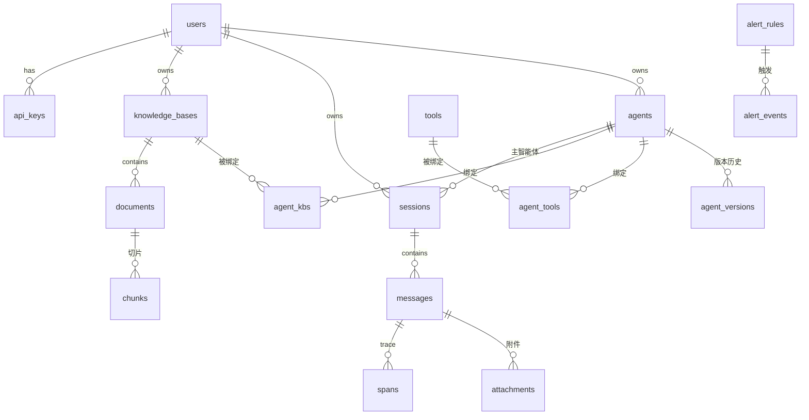

# 02 数据库设计

> PostgreSQL 16 + pgvector。所有用户资源表带 `owner` 冗余或经 JOIN 可达，隔离策略见 [[03-安全与权限]]。

## 2.1 ER 关系图



## 2.2 两个关键设计决策

> [!important] 决策一：消息内容用 `messages.blocks` (JSONB)
> 一条助手消息 = **有序块列表**：`thinking / text / tool_call / tool_result / citation`。前端按块渲染（思考链折叠、引用角标、工具卡片），无需拆多表再拼装。块的完整 Schema 见 [[06-会话与消息流]]。

> [!important] 决策二：观测数据用统一 `spans` 表（Langfuse 式）
> LLM 调用、工具执行、检索、模型切换全部是 span（`trace_id` = 一次生成）。会话详情时间线、工具日志、仪表盘聚合、告警全部从这一张表出——一次埋点，处处可用。见 [[08-监控与可观测性]]。

## 2.3 全量 DDL

### 用户与安全

```sql
CREATE TABLE users (
    id            UUID PRIMARY KEY DEFAULT gen_random_uuid(),
    username      VARCHAR(32)  UNIQUE NOT NULL,
    email         VARCHAR(128) UNIQUE NOT NULL,
    password_hash VARCHAR(255) NOT NULL,                 -- bcrypt
    display_name  VARCHAR(64),
    avatar        VARCHAR(16)  DEFAULT '🤖',
    role          VARCHAR(16)  NOT NULL DEFAULT 'user',  -- user / admin
    status        VARCHAR(16)  NOT NULL DEFAULT 'active',-- active / disabled
    created_at    TIMESTAMPTZ NOT NULL DEFAULT now(),
    updated_at    TIMESTAMPTZ NOT NULL DEFAULT now()
);

CREATE TABLE refresh_tokens (
    id         UUID PRIMARY KEY DEFAULT gen_random_uuid(),
    user_id    UUID NOT NULL REFERENCES users(id) ON DELETE CASCADE,
    token_hash VARCHAR(255) NOT NULL,
    expires_at TIMESTAMPTZ NOT NULL,
    revoked    BOOLEAN DEFAULT false,
    created_at TIMESTAMPTZ DEFAULT now()
);
CREATE INDEX idx_refresh_user ON refresh_tokens(user_id);

CREATE TABLE api_keys (                     -- OpenAI 兼容端点密钥
    id           UUID PRIMARY KEY DEFAULT gen_random_uuid(),
    user_id      UUID NOT NULL REFERENCES users(id) ON DELETE CASCADE,
    name         VARCHAR(64) NOT NULL,
    key_prefix   VARCHAR(12) NOT NULL,      -- 明文前缀 sk-xxxx，列表识别用
    key_hash     VARCHAR(255) NOT NULL,     -- 完整密钥哈希，明文只在创建时展示一次
    last_used_at TIMESTAMPTZ,
    revoked      BOOLEAN DEFAULT false,
    created_at   TIMESTAMPTZ DEFAULT now()
);
```

### 智能体与工具

```sql
CREATE TABLE agents (
    id              UUID PRIMARY KEY DEFAULT gen_random_uuid(),
    owner_id        UUID NOT NULL REFERENCES users(id) ON DELETE CASCADE,
    name            VARCHAR(64) NOT NULL,
    emoji           VARCHAR(8)  DEFAULT '🤖',
    description     TEXT,
    tags            TEXT[] DEFAULT '{}',
    system_prompt   TEXT NOT NULL,               -- 支持 {{user.name}} 变量插值
    model_config    JSONB NOT NULL,              -- Schema 见 [[04-智能体管理模块]]
    welcome_msg     TEXT,
    status          VARCHAR(16) DEFAULT 'draft', -- draft / published / archived
    current_version INT DEFAULT 1,
    created_at      TIMESTAMPTZ DEFAULT now(),
    updated_at      TIMESTAMPTZ DEFAULT now()
);
CREATE INDEX idx_agents_owner ON agents(owner_id);

CREATE TABLE agent_versions (                    -- 发布快照，支持回滚
    id           UUID PRIMARY KEY DEFAULT gen_random_uuid(),
    agent_id     UUID NOT NULL REFERENCES agents(id) ON DELETE CASCADE,
    version      INT NOT NULL,
    snapshot     JSONB NOT NULL,                 -- 上述可变配置列打包
    published_by UUID REFERENCES users(id),
    created_at   TIMESTAMPTZ DEFAULT now(),
    UNIQUE (agent_id, version)
);

CREATE TABLE tools (                             -- 工具定义即数据
    id          UUID PRIMARY KEY DEFAULT gen_random_uuid(),
    slug        VARCHAR(64) UNIQUE NOT NULL,     -- kb_search / web_search / time_now ...
    name        VARCHAR(64) NOT NULL,
    description TEXT NOT NULL,                   -- 会进系统提示词/function calling
    input_schema JSONB NOT NULL,                 -- 标准 JSON Schema
    category    VARCHAR(32),                     -- knowledge / web / system
    is_system   BOOLEAN DEFAULT false,           -- 系统内置不可删
    enabled     BOOLEAN DEFAULT true
);

CREATE TABLE agent_tools (
    agent_id UUID REFERENCES agents(id) ON DELETE CASCADE,
    tool_id  UUID REFERENCES tools(id)  ON DELETE CASCADE,
    config   JSONB DEFAULT '{}',                 -- 每绑定参数覆盖：timeout、白名单等
    PRIMARY KEY (agent_id, tool_id)
);
```

### 知识库

```sql
CREATE TABLE knowledge_bases (
    id             UUID PRIMARY KEY DEFAULT gen_random_uuid(),
    owner_id       UUID NOT NULL REFERENCES users(id) ON DELETE CASCADE,
    name           VARCHAR(64) NOT NULL,
    description    TEXT,
    embedding_model VARCHAR(64) DEFAULT 'bge-m3',
    chunk_size     INT DEFAULT 512,              -- token
    chunk_overlap  INT DEFAULT 64,
    created_at     TIMESTAMPTZ DEFAULT now(),
    updated_at     TIMESTAMPTZ DEFAULT now()
);

CREATE TABLE agent_kbs (
    agent_id        UUID REFERENCES agents(id) ON DELETE CASCADE,
    kb_id           UUID REFERENCES knowledge_bases(id) ON DELETE CASCADE,
    top_k           INT DEFAULT 5,
    score_threshold REAL DEFAULT 0.3,
    PRIMARY KEY (agent_id, kb_id)
);

CREATE TABLE documents (
    id          UUID PRIMARY KEY DEFAULT gen_random_uuid(),
    kb_id       UUID NOT NULL REFERENCES knowledge_bases(id) ON DELETE CASCADE,
    filename    VARCHAR(255) NOT NULL,
    file_type   VARCHAR(16) NOT NULL,            -- pdf / md / docx / txt
    size_bytes  BIGINT NOT NULL,
    status      VARCHAR(16) DEFAULT 'pending',   -- pending/parsing/chunking/embedding/ready/failed
    error       TEXT,
    chunk_count INT DEFAULT 0,
    meta        JSONB,                           -- 页数、标题树等
    uploaded_by UUID REFERENCES users(id),
    created_at  TIMESTAMPTZ DEFAULT now(),
    updated_at  TIMESTAMPTZ DEFAULT now()
);
CREATE INDEX idx_documents_kb ON documents(kb_id, created_at DESC);

CREATE TABLE chunks (
    id           UUID PRIMARY KEY DEFAULT gen_random_uuid(),
    document_id  UUID NOT NULL REFERENCES documents(id) ON DELETE CASCADE,
    kb_id        UUID NOT NULL REFERENCES knowledge_bases(id) ON DELETE CASCADE,
    content      TEXT NOT NULL,                  -- 原文切片
    content_tokens TEXT NOT NULL,                -- ★ jieba 分词后空格拼接（中文 FTS 方案）
    chunk_index  INT NOT NULL,
    token_count  INT,
    meta         JSONB,                          -- {page, headings}；headings 为章节路径 list[str]，仅 Markdown 来源
    tsv tsvector GENERATED ALWAYS AS
        (to_tsvector('simple', content_tokens)) STORED,   -- 两参形式不可变，可生成列
    embedding    vector(1024) NOT NULL,          -- bge-m3
    UNIQUE (document_id, chunk_index)
);
CREATE INDEX idx_chunks_hnsw ON chunks USING hnsw (embedding vector_cosine_ops);
CREATE INDEX idx_chunks_fts  ON chunks USING gin (tsv);
```

### 会话与消息

```sql
CREATE TABLE sessions (
    id              UUID PRIMARY KEY DEFAULT gen_random_uuid(),
    user_id         UUID NOT NULL REFERENCES users(id) ON DELETE CASCADE,
    agent_id        UUID REFERENCES agents(id),   -- 主智能体
    title           VARCHAR(128) DEFAULT '新对话',
    pinned          BOOLEAN DEFAULT false,
    archived        BOOLEAN DEFAULT false,
    last_message_at TIMESTAMPTZ,
    created_at      TIMESTAMPTZ DEFAULT now(),
    updated_at      TIMESTAMPTZ DEFAULT now()
);
CREATE INDEX idx_sessions_user ON sessions(user_id, last_message_at DESC);
CREATE INDEX idx_sessions_title_fts ON sessions USING gin
    (to_tsvector('simple', title));

CREATE TABLE messages (
    id           UUID PRIMARY KEY DEFAULT gen_random_uuid(),
    session_id   UUID NOT NULL REFERENCES sessions(id) ON DELETE CASCADE,
    agent_id     UUID REFERENCES agents(id),      -- 哪个智能体产生（@接力时不同）
    agent_version INT,                            -- 生成时的配置快照版本
    role         VARCHAR(16) NOT NULL,            -- user / assistant / tool / system
    blocks       JSONB NOT NULL DEFAULT '[]',     -- ★ 有序内容块
    mentions     JSONB DEFAULT '[]',              -- @提及的智能体 id 列表
    model        VARCHAR(64),
    status       VARCHAR(16) DEFAULT 'done',      -- streaming/done/stopped/error
    usage        JSONB,                           -- {prompt_tokens, completion_tokens, total_ms, first_token_ms}
    rating       SMALLINT,                        -- 1 有用 / -1 无用 / NULL
    error        TEXT,
    created_at   TIMESTAMPTZ DEFAULT now()
);
CREATE INDEX idx_messages_session ON messages(session_id, created_at);

CREATE TABLE attachments (
    id            UUID PRIMARY KEY DEFAULT gen_random_uuid(),
    message_id    UUID REFERENCES messages(id) ON DELETE CASCADE,
    session_id    UUID NOT NULL,                  -- 冗余，上传时消息未创建
    file_path     VARCHAR(512) NOT NULL,          -- uploads/{uuid}.{ext}
    original_name VARCHAR(255) NOT NULL,
    mime_type     VARCHAR(128) NOT NULL,
    size_bytes    BIGINT NOT NULL,
    kind          VARCHAR(16) NOT NULL,           -- image / document
    created_at    TIMESTAMPTZ DEFAULT now()
);
```

### 模型注册与观测

```sql
CREATE TABLE models (                            -- 模型注册表（/api/tags 同步 + 人工补充）
    name            VARCHAR(128) PRIMARY KEY,    -- qwen2.5:7b-instruct-q4_K_M
    family          VARCHAR(32),
    purpose         VARCHAR(16) NOT NULL,        -- main / thinking / vision / embedding
    supports_tools  BOOLEAN DEFAULT false,
    supports_thinking BOOLEAN DEFAULT false,
    reference_price_in  REAL DEFAULT 0,          -- $/1M tokens（本地模型填等效参考价）
    reference_price_out REAL DEFAULT 0,
    enabled       BOOLEAN DEFAULT true
);

CREATE TABLE spans (                             -- ★ 统一观测表
    id              UUID PRIMARY KEY DEFAULT gen_random_uuid(),
    trace_id        UUID NOT NULL,               -- = 一次生成
    parent_span_id  UUID REFERENCES spans(id),
    session_id      UUID, message_id     UUID,
    agent_id        UUID, user_id        UUID,   -- 冗余，供后台聚合
    type            VARCHAR(16) NOT NULL,        -- llm / tool / retrieval / model_switch
    name            VARCHAR(128),                -- qwen2.5:7b / web_search / kb检索
    input           JSONB, output       JSONB,   -- 原文（大输出截断至 32KB）
    status          VARCHAR(16) DEFAULT 'ok',    -- ok / error / timeout
    error           TEXT,
    prompt_tokens   INT, completion_tokens INT,
    model           VARCHAR(64),
    started_at      TIMESTAMPTZ NOT NULL,
    ended_at        TIMESTAMPTZ,
    duration_ms     INT
);
CREATE INDEX idx_spans_trace  ON spans(trace_id);
CREATE INDEX idx_spans_agg    ON spans(started_at, type);
CREATE INDEX idx_spans_agent  ON spans(agent_id, started_at DESC);

CREATE TABLE model_events (                      -- 加载/卸载历史（时序）
    id BIGSERIAL PRIMARY KEY,
    model VARCHAR(64) NOT NULL,
    action VARCHAR(16) NOT NULL,                 -- load / unload / evict / load_failed
    trigger VARCHAR(32),                         -- manual / auto_switch / preload
    duration_ms INT, vram_before_mb INT, vram_after_mb INT,
    error TEXT, created_at TIMESTAMPTZ DEFAULT now()
);

CREATE TABLE alert_rules (
    id UUID PRIMARY KEY DEFAULT gen_random_uuid(),
    metric VARCHAR(32) NOT NULL,     -- error_rate / p95_latency / daily_tokens / vram_usage
    operator VARCHAR(8) NOT NULL,    -- gt / lt
    threshold REAL NOT NULL,
    window_minutes INT DEFAULT 5,
    enabled BOOLEAN DEFAULT true,
    created_at TIMESTAMPTZ DEFAULT now()
);
CREATE TABLE alert_events (
    id UUID PRIMARY KEY DEFAULT gen_random_uuid(),
    rule_id UUID REFERENCES alert_rules(id) ON DELETE CASCADE,
    metric_value REAL NOT NULL,
    message TEXT NOT NULL,
    acknowledged BOOLEAN DEFAULT false,
    created_at TIMESTAMPTZ DEFAULT now()
);
```

## 2.4 数据保留与运维

- `spans` 保留 90 天、`model_events` 保留 30 天：每日定时任务清理，防个人库无限膨胀。
- `chunks` 级联删除挂在 `document → kb` 链上，删文档即清向量。
- Alembic 管理全部迁移，`seed.py` 灌演示数据（见 [[10-部署与简历叙事]]）。
