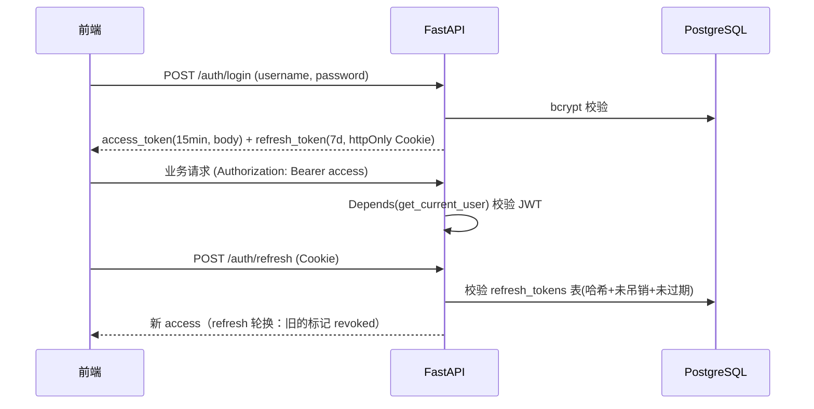

# 03 安全与权限

## 3.1 认证：JWT 双令牌

- 哈希：`bcrypt`（passlib）。登录失败统一报"用户名或密码错误"，不限流内内嵌防爆破（slowapi 每 IP 10 次/分钟）。
- `refresh_tokens` 入库（哈希存储）支持**吊销**与**轮换**——比纯无状态 JWT 更安全，也是面试讲点。
- `get_current_user` 为 FastAPI 依赖，路由声明即生效；`admin` 依赖在其上叠加角色校验（后台 `/admin/*` 全部要求 admin）。

## 3.2 多用户数据隔离（核心）

> [!important] 原则：隔离不靠接口自觉，靠 repository 层统一注入
> 所有用户资源查询经 repository 封装，**强制**追加 `owner_id = current_user.id`（或经 JOIN 校验归属）。代码评审角度：任何绕过 repository 的裸查询都是违例。

- 前置校验模式：对子资源（session/message/document），先 `WHERE id=:id AND owner_id=:uid` 取不到即 404（不返回 403，避免资源存在性泄露）。
- 可选加固（简历加分项）：Postgres **RLS 行级安全**，`USING (owner_id = current_setting('app.user_id')::uuid)`，在 DB 层兜底。文档标注为进阶项，MVP 不启。

## 3.3 角色模型

| 角色 | 能力 |
|---|---|
| `user` | 管理自己的智能体/知识库/会话/密钥；调用聊天与 OpenAI 兼容端点（用自己绑定的资源） |
| `admin` | 以上全部 + 后台：全局仪表盘、任意会话详情（脱敏视图）、模型/显存管理、告警规则、日志导出 |

## 3.4 API 密钥管理

- 平台提供 **OpenAI 兼容端点** `POST /v1/chat/completions`，外部程序可用标准 OpenAI SDK 调用"某个智能体"（`model` 字段传 `agent:{agent_id}`）。
- 密钥格式 `sk-` + 32 位随机；**明文仅创建响应返回一次**，库存 SHA-256 哈希 + 前缀明文（列表识别用）；支持吊销；记录 `last_used_at`。
- 鉴权走 `Authorization: Bearer sk-...`，与用户 JWT 并行的第二套认证依赖。

## 3.5 上传安全

| 项 | 对策 |
|---|---|
| 类型 | 白名单：`pdf / md / txt / docx / png / jpg / webp`；按 magic bytes 校验而非仅扩展名 |
| 大小 | 单文件 ≤ 20MB；单知识库 ≤ 50 文件（软限制可配） |
| 存储 | 文件名服务端重新生成为 `{uuid}.{ext}`，杜绝路径穿越；`kind=image` 才允许进入多模态链路 |
| 处理 | 解析在 ARQ worker 进程执行，崩溃不影响 API 进程 |

## 3.6 工具执行安全

> [!warning] 取舍声明：**不提供任意代码执行类工具**（沙箱成本过高）
> - 工具白名单注册制：只有 `TOOL_REGISTRY` 里注册过的实现可被调用，模型只能"点名"，不能注入代码。
> - 单工具 `asyncio.wait_for` 超时（默认 30s，绑定级可覆盖）；输出截断至 8KB 再回填上下文。
> - `http_request` 工具禁访问内网地址（SSRF 防护：解析目标 IP，拒绝私网/环回段）。
> - 工具循环上限 5 轮，防死循环（见 [[06-会话与消息流]]）。

## 3.7 内容安全

- 本地部署：数据不出机，天然满足隐私叙事（面试讲点）。
- 输入侧：长度上限（单条 8K 字符）、附件数量上限；可选简单敏感词表（演示级）。
- 输出侧：前端 `react-markdown` **默认不渲染原始 HTML**（XSS 防线），代码高亮经 shiki 转义。
- CORS 白名单（仅前端域名）；slowapi 全局限流（60 req/min/user，聊天 10 req/min/user）；`pydantic-settings` 管 `.env`，密钥不进 git。

## 3.8 安全检查清单（上线前）

- [ ] 依赖 `pip audit` / `pnpm audit` 通过
- [ ] 所有路由显式声明认证依赖（默认拒绝模式）
- [ ] repository 层隔离注入覆盖全部用户资源查询
- [ ] 上传目录禁止执行权限、nginx 不解析 uploads 内 PHP/脚本（静态托管本就不解析）
- [ ] JWT secret ≥ 32 位随机、`.env` 不入库（`.gitignore` + 提供 `.env.example`）
