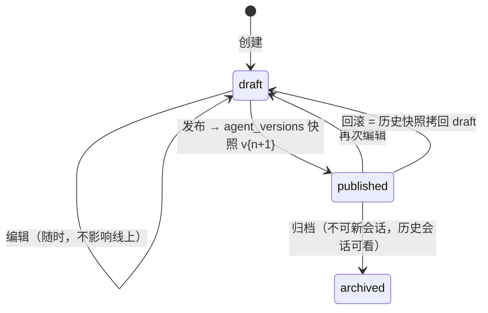

# 04 智能体管理模块

## 4.1 配置数据结构（model_config JSON Schema）

后台表单按此 Schema 渲染；保存时 Pydantic 校验：

```jsonc
{
  "provider": "ollama",
  "model": "qwen2.5:7b-instruct-q4_K_M",   // 前端从 GET /models 动态拉取可选列表
  "temperature": 0.7,          // 0~2, step 0.1
  "top_p": 0.9,                // 0~1
  "max_tokens": 2048,          // 128~8192
  "num_ctx": 8192,             // 2048~32768，注意显存预算（见 [[07-模型动态加载与切换]]）
  "supports_thinking": false,  // R1 系为 true：前端据此渲染思考链折叠
  "history_rounds": 10,        // 上下文携带的历史轮数
  "fallback_model": null       // 进阶：加载失败降级
}
```

Pydantic 校验模型：

```python
class ModelConfig(BaseModel):
    provider: Literal["ollama"] = "ollama"
    model: str
    temperature: float = Field(0.7, ge=0, le=2)
    top_p: float = Field(0.9, ge=0, le=1)
    max_tokens: int = Field(2048, ge=128, le=8192)
    num_ctx: int = Field(8192, ge=2048, le=32768)
    supports_thinking: bool = False
    history_rounds: int = Field(10, ge=1, le=50)
    fallback_model: str | None = None
```

## 4.2 系统提示词变量插值

- 语法：`{{user.name}}`、`{{today}}`、`{{session.title}}`、`{{agent.name}}`。
- **保存时**：正则 `\{\{\s*([\w.]+)\s*\}\}` 提取全部变量名，未知变量名标黄警告（不阻断保存）。
- **运行时**：AgentRuntime 构建上下文时解析——保证用户改名等立即生效，无需刷新智能体配置。
- 转义：`\{\{` 字面量用 `{{{{}}` 表示（与 Jinja2 习惯一致）。

```python
VAR_RESOLVERS: dict[str, Callable[[Context], str]] = {
    "user.name":     lambda c: c.user.display_name or c.user.username,
    "today":         lambda c: date.today().isoformat(),
    "session.title": lambda c: c.session.title,
    "agent.name":    lambda c: c.agent.name,
}

def render_prompt(template: str, ctx: Context) -> str:
    def sub(m: re.Match) -> str:
        key = m.group(1)
        if key not in VAR_RESOLVERS:
            return m.group(0)                      # 未知变量原样保留，便于发现
        return str(VAR_RESOLVERS[key](ctx))
    return re.sub(r"\{\{\s*([\w.]+)\s*\}\}", sub, template)
```

## 4.3 工具库管理

**定义即代码，注册即数据**：装饰器注册，签名自动生成 JSON Schema，无需手写 schema。

```python
# backend/app/ai/tools/registry.py
@dataclass
class ToolDef:
    slug: str
    name: str
    description: str          # 直接喂给模型，质量决定调用准确率
    input_schema: dict        # 由函数签名自动生成
    handler: Callable
    category: str

TOOL_REGISTRY: dict[str, ToolDef] = {}

def tool(slug: str, name: str, description: str, category: str = "general"):
    def decorator(fn):
        TOOL_REGISTRY[slug] = ToolDef(
            slug=slug, name=name, description=description, category=category,
            input_schema=schema_from_signature(fn),
            handler=fn)
        return fn
    return decorator

def schema_from_signature(fn: Callable) -> dict:
    """由函数签名动态构建 pydantic 模型 → 标准 JSON Schema"""
    params = inspect.signature(fn).parameters
    fields = {
        pname: (p.annotation if p.annotation is not inspect.Parameter.empty else str,
                p.default if p.default is not inspect.Parameter.empty else ...)
        for pname, p in params.items()
    }
    return create_model(fn.__name__, **fields).model_json_schema()

# ---- 内置工具（M2 起）----
@tool("time_now", "当前时间", "获取今天的日期与星期", category="system")
async def time_now() -> str: ...

@tool("kb_search", "知识库检索", "在当前智能体绑定的知识库中检索相关文档片段",
      category="knowledge")
async def kb_search(query: str, top_k: int = 5) -> str: ...

@tool("web_search", "联网搜索", "搜索互联网获取实时信息（M4）", category="web")
async def web_search(query: str, max_results: int = 5) -> str: ...

@tool("http_request", "HTTP请求", "向指定 URL 发起 GET 请求（含 SSRF 防护，M5）",
      category="web")
async def http_request(url: str) -> str: ...
```

**绑定关系**（`agent_tools` 表，见 [[02-数据库设计]]）：

- 后台"工具勾选矩阵"：行 = 智能体，列 = 启用的工具，勾选即写 `agent_tools`。
- 每绑定可覆盖参数：`config JSONB`（如该智能体下 `web_search` 超时 15s）。
- 启动时 / 工具变更时同步 `tools` 表 ← `TOOL_REGISTRY`（slug 对齐，description 以代码为准）。

**运行时下发**（Ollama 原生 function calling）：

```python
tools_payload = [{
    "type": "function",
    "function": {
        "name": t.slug,
        "description": t.description,
        "parameters": t.input_schema,
    }} for t in bound_tools]
# → 传入 provider.chat_stream(req)；模型返回 message.tool_calls 时由 AgentRuntime 执行
```

## 4.4 版本控制：草稿-发布-回滚



- `agents` 行 = 当前草稿 + 当前版本号；`agent_versions.snapshot` = 发布时点的 `{system_prompt, model_config, tags, welcome_msg, tool_ids, kb_bindings}` JSONB。
- **消息级追溯**：`messages.agent_version` 记录生成时版本，后台可还原"当时用的什么提示词"（从快照读）——可观测性闭环的一部分。
- 删除保护：被会话引用的智能体只允许**归档**，不允许物理删除。
