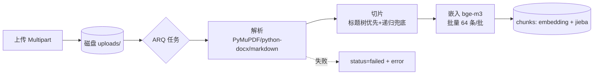

# 05 知识库 RAG

## 5.1 向量存储选型：pgvector（对比）

| 维度 | **pgvector ✅** | Qdrant | Milvus |
|---|---|---|---|
| 运维成本 | 零（复用 PG，compose 少一服务） | 中（多一服务+双写同步） | 高 |
| 与业务表关联 | 天然 JOIN / 事务 / 外键 | 需应用层双写 | 同左 |
| 规模上限 | HNSW 到百万级 chunk 无压力 | 千万级 | 亿级 |
| 元数据过滤 | SQL WHERE 随意组合 | payload 过滤 | 标量过滤 |
| 备份/迁移 | pg_dump 一把梭 | 快照工具 | 复杂 |
| 结论 | **本项目规模（个人知识库，万级 chunk）远未触顶**；"单库事务"对演示/面试都更优雅 | 规模上来再换（Provider 已抽象） | 过度设计 |

## 5.2 Ingest 流水线（ARQ 异步）



- 文档状态机：`pending → parsing → chunking → embedding → ready / failed`，前端轮询徽章展示进度。
- 每步记 `retrieval` 前置 span 或直接 `documents.error`，失败可重试（重置状态重新入队）。
- **幂等**：重传同文件 = 删旧 document（级联删 chunks）再走流水线。

## 5.3 切片策略

| 参数 | 值 | 说明 |
|---|---|---|
| chunk_size | 512 token | 用 tiktoken 粗算 |
| chunk_overlap | 64 token | 保住跨片语义 |
| 优先级 | Markdown 标题树 > 段落 > 递归字符 | PDF 先转伪 Markdown（PyMuPDF 提取 heading） |
| meta | `{page, headings}` | 页码支撑引用溯源跳转；headings 为章节路径 `list[str]`，仅 Markdown 来源 |
| 表格 | 简单策略：整表保持单 chunk（超长截断） | 深度表格解析（表格转行描述）标注为进阶项 |

> [!warning] 已知坑
> - **扫描版 PDF 无文字层** → 解析结果为空：检测后标记 `failed(扫描件，暂不支持OCR)`。OCR 进阶可选 tesseract/paddleocr。
> - **PDF 双栏/页眉页脚** → 噪声：PyMuPDF 按坐标排序 + 去页眉页脚启发式。
> - **超长单段**（如压缩 JSON）→ 递归兜底按符号层级切。

## 5.4 嵌入模型

- **bge-m3**（Ollama 直接 `ollama pull bge-m3`）：中文效果好、1024 维、支持稠密+稀疏。
- 显存约 1~2GB，与 LLM **分时复用**（经 [[07-模型动态加载与切换]] 的 ModelManager 统一调度，embedding 短平快，切换开销可接受）。
- 摄入批量化：64 条/批一次请求，千页文档分钟级完成。

## 5.5 混合检索 + RRF 融合

**中文全文检索的坑与解法**：PG 内置分词器不切中文，`zhparser` 扩展在 Windows/Docker 里难装。**解法：入库时 jieba 分词 → 空格拼接 → `content_tokens` 列 → `tsvector('simple')` 生成列**（[[02-数据库设计]] 已建索引）。查询侧同样先 jieba 分词。

```sql
-- 混合检索（双通道各取 40 路 → UNION ALL → RRF 融合取 top_k）
-- 注意：两通道必须 UNION ALL 后按 id 分组求和，任何 JOIN 写法都会丢失"单通道命中"的结果
WITH semantic AS (                       -- 向量通道：HNSW 余弦
    SELECT id, ROW_NUMBER() OVER (ORDER BY embedding <=> :qvec) AS r
    FROM chunks
    WHERE kb_id = ANY(:kb_ids)
    ORDER BY embedding <=> :qvec
    LIMIT 40),
fulltext AS (                            -- 关键词通道：GIN 全文
    SELECT c.id, ROW_NUMBER() OVER (ORDER BY ts_rank(c.tsv, q) DESC) AS r
    FROM chunks c, plainto_tsquery('simple', :tokens) q
    WHERE c.kb_id = ANY(:kb_ids) AND c.tsv @@ q
    ORDER BY ts_rank(c.tsv, q) DESC
    LIMIT 40),
fused AS (
    SELECT id, SUM(1.0 / (60 + r)) AS rrf_score,
           count(*) AS channel_hits       -- 命中通道数：2 = 双通道认可，可解释性指标
    FROM (SELECT id, r FROM semantic
          UNION ALL
          SELECT id, r FROM fulltext) t
    GROUP BY id)
SELECT c.id, c.content, c.meta, f.rrf_score, f.channel_hits
FROM fused f
JOIN chunks c ON c.id = f.id
ORDER BY f.rrf_score DESC
LIMIT :top_k;
```

- RRF 常数 k=60（标准值）；双通道无距离量纲问题，鲁棒。
- 每路得分保留进 `meta`，后台检索 span 可看到"为什么命中"——可解释性是面试亮点。

## 5.6 引用注入与溯源

1. 检索结果按序编号，组装进 system 消息：

```
[知识库检索结果]
[1] (来源: Java并发编程.pdf p12) ……切片原文……
[2] (来源: 架构整洁之道.md) ……切片原文……
回答时请用 [1][2] 形式标注引用；检索结果未覆盖时明确说明。
```

2. 模型输出中的 `[1]` 由前端 citation 事件/正则渲染为角标 + 悬浮卡片（文件名/页码/原文片段/得分），点击侧滑全文定位（见 [[09-前端交互设计]]）。
3. `citation` SSE 事件在检索完成后、token 开始前发出，前端可先挂占位。

## 5.7 与智能体绑定

- `agent_kbs` 绑定表：每绑定独立 `top_k / score_threshold`。
- AgentRuntime 构建上下文时：有绑定 → 执行检索（记 span）→ 注入；无绑定 → 跳过。
- `kb_search` 工具与"自动注入"并存：自动注入保证兜底，工具形式让模型**按需**多次检索（改写 query 二次检索）。

## 5.8 评估（进阶，可砍）

- 黄金问答集（20~50 条 QA + 标准来源）→ 脚本算 **recall@5 / citation 准确率** → 调 chunk_size / top_k。
- 有这个小脚本，"RAG 效果怎么衡量"的面试题就有实据可答。
