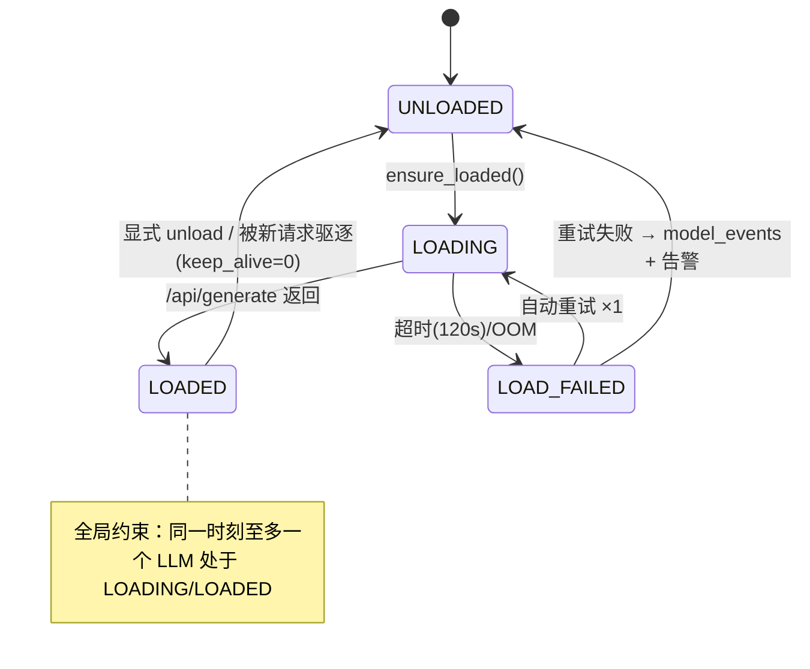

# 07 模型动态加载与切换

## 7.1 显存预算（为什么是单槽位）

RTX 5070 Ti Laptop = **12GB**，减去系统/桌面占用 1~1.5GB、CUDA 上下文 ~0.5GB，**可用约 10GB**：

| 模型 | 用途 | 量化 | 磁盘 | 常驻显存（4~8K ctx） |
|---|---|---|---|---|
| qwen2.5:7b-instruct-q4_K_M | 主力对话 + 工具调用 | Q4_K_M | 4.7GB | 权重 4.7 + KV 1.5~2 ≈ **6~7GB** |
| deepseek-r1-distill-qwen:7b | 深度思考（thinking） | Q4_K_M | 4.7GB | ≈ 6~7GB |
| qwen2.5vl:7b | 图片理解 | Q4 | ~6GB | ≈ 8~10GB（吃紧） |
| bge-m3 | 嵌入 | F16 | 1.2GB | ≈ 1.5GB |

结论：两个 7B 同驻 + KV cache 必然 OOM 或触发 Ollama CPU 回退（速度崩塌）。**策略：单活跃槽位 + 接力切换**。

> [!tip] 选型可替换
> 2025 后 Ollama 上的 `qwen3:8b` / `qwen3:4b`（工具调用与推理更强）是主力模型的零成本替换——只改 `model_config.model` 字符串，这正是 ModelProvider + 配置化选型的价值。

## 7.2 状态机



## 7.3 ModelManager 实现

```python
class ModelManager:
    """单活跃槽位：同一时刻至多一个 LLM 驻留显存（Ollama 实现细节封装在此）"""
    def __init__(self, provider: ModelProvider):
        self.provider = provider
        self._lock = asyncio.Lock()        # 仅互斥"切换临界区"，不锁整个生成过程
        self._current: str | None = None

    async def acquire(self, model: str, on_switch=None) -> None:
        async with self._lock:
            if self._current == model:
                return                                    # 命中，零开销
            if self._current:                             # 接力：先卸载当前
                await self.provider.unload(self._current)
                await log_model_event(self._current, "unload", trigger="evict")
            if on_switch:
                await on_switch(self._current, model)     # SSE: model_switching
            t0 = time.monotonic()
            await self.provider.ensure_loaded(model)      # 冷加载 10~30s
            await log_model_event(model, "load",
                                  duration_ms=int((time.monotonic()-t0)*1000))
            self._current = model

    async def watch(self):                                # 每 10s 显存值守
        while True:
            loaded = await self.provider.list_loaded()    # /api/ps: size_vram
            vram = await gpu_memory_used()                # nvidia-smi（可选）
            await record_vram_metric(vram, loaded)        # → 后台显存曲线
            await asyncio.sleep(10)
```

> [!important] 设计权衡：锁的粒度
> 锁只包住"卸载→加载"临界区。**生成过程不持锁**（否则一次 3 分钟的流式生成会阻塞一切）。代价：两个会话交替用不同模型时会"乒乓切换"。缓解：keep_alive=15m 使旧模型短暂驻留（Ollama 自动驱逐兜底）+ 后台 model_events 监控切换频率，乒乓严重时提示用户归组会话。这个权衡是现成的系统设计面试答案。

## 7.4 Ollama API 速查（全部用到的端点）

| 端点 | 用途 | 关键参数 |
|---|---|---|
| `POST /api/chat` | 流式对话 + function calling | `stream:true`、`tools`、`options.{temperature,top_p,num_ctx,num_predict}`、`keep_alive:"15m"` |
| `POST /api/generate` | **预热加载**（空 prompt + keep_alive） / **卸载**（keep_alive=0） | `{"model": m, "prompt": "", "keep_alive": ...}` |
| `GET /api/ps` | 已加载模型及显存占用 | 返回 `size_vram`、`expires_at` |
| `GET /api/tags` | 可用模型列表 | 供智能体表单下拉 + models 表同步 |
| `GET /api/show` | 模型详情（family、能力） | 判定 supports_tools / vision |

## 7.5 显存监控

- 数据源：`/api/ps`（Ollama 视角）+ `nvidia-smi --query-gpu=memory.used --format=csv,noheader,nounits`（整机视角，Windows 可用 pynvml）。
- 每 10s 采样 → 内存环形缓冲 + 低频落库（1min 一个点）→ 后台显存曲线 + `model_events` 加载耗时统计。
- 告警规则可订阅 `vram_usage > 11000MB` 持续 5min（异常回退 CPU 的信号，见 [[08-监控与可观测性]]）。

## 7.6 对外 API

```
GET  /api/v1/models                    # 可用模型（/api/tags 合成 models 表能力标记）
GET  /api/v1/models/status             # {current, loaded:[{name, vram_mb, expires_at}], history 最近事件}
POST /api/v1/models/{name}/load        # 手动预热（后台"模型管理"页按钮）
POST /api/v1/models/{name}/unload      # 手动卸载
```

前端在输入框上方常驻"当前驻留模型"徽标；触发切换时显示进度提示（冷加载 10~30s 的预期管理）。
